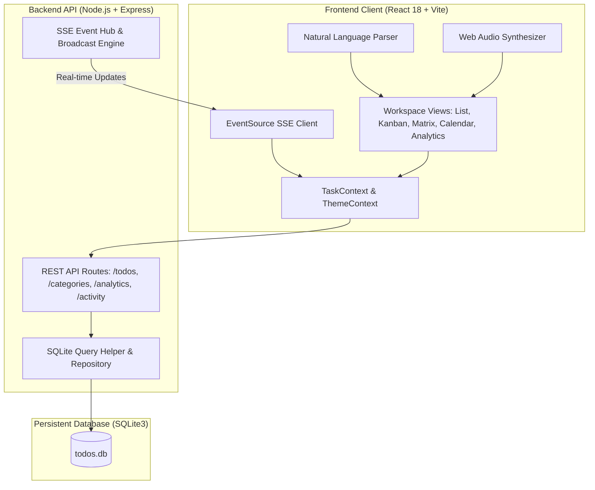
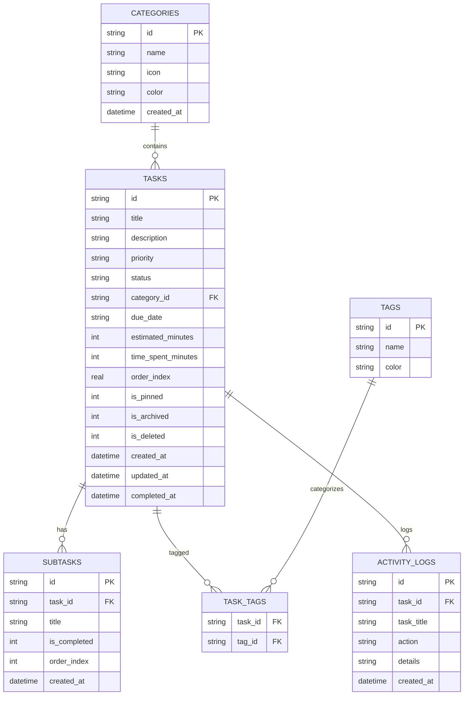

# Zenith Task — System Architecture & Design Document (LLD / HLD)

## 1. Executive Overview
Zenith Task is an end-to-end dynamic productivity workspace designed to provide an industry-leading task management experience. It combines real-time data persistence, natural language processing, multiple visualization paradigms (List, Kanban, Eisenhower Matrix, Calendar Timeline, Analytics Telemetry), an embedded Pomodoro focus engine, and low-latency acoustic/visual feedback.

---

## 2. System Architecture

---

## 3. Data Models & Database Schema

### 3.1 Entity Relationship Diagram

---

## 4. Component Hierarchy & Module Breakdown

### 4.1 Frontend Component Tree
- **`App.jsx`**: Core layout container with Context providers.
  - **`Sidebar.jsx`**: Focus lists (*All*, *Today*, *Upcoming*, *Important*, *Completed*), category manager, tags filter, sound & shortcut controls.
  - **`Header.jsx`**: Global search input, view switcher tabs, Pomodoro launcher, accent palette picker, dark/light toggle, Command Palette trigger.
  - **`MainContent`**:
    - **`ListView.jsx`**: Smart date grouping (*Overdue*, *Today*, *Tomorrow*, *Upcoming*, *Completed*) with collapsible buckets.
      - **`QuickAddBar.jsx`**: Token parser with live pills.
      - **`TaskItem.jsx`**: Individual task row with micro-interactions, subtask progress, badges, and hover actions.
    - **`KanbanView.jsx`**: 4-column drag-and-drop workflow board (*To Do*, *In Progress*, *In Review*, *Done*).
    - **`EisenhowerMatrix.jsx`**: 2x2 decision quadrant (*Urgent & Important*, *Important & Not Urgent*, *Urgent & Not Important*, *Eliminate*).
    - **`CalendarView.jsx`**: Monthly grid with task chips and date scheduling.
    - **`AnalyticsDashboard.jsx`**: Velocity gauge, streak tracker, 30-day activity heatmap, priority & category charts.
  - **Modals & Overlays**:
    - **`TaskDetailModal.jsx`**: Full task property editor and subtask checklist manager.
    - **`PomodoroTimer.jsx`**: 25m Focus / 5m Break timer linked to tasks with time-logging.
    - **`CommandPalette.jsx`**: `Ctrl+K` searchable command interface.
    - **`BatchActionBar.jsx`**: Bulk action floating toolbar for selected tasks.
    - **`ShortcutsModal.jsx`**: Keyboard shortcuts reference.
    - **`TagsModal.jsx`**: Dynamic tag creator and manager.

---

## 5. Key Technical Innovations

### 5.1 Natural Language Processing Engine (`nlpParser.js`)
Extracts structured parameters from unformatted user input:
- **Priority**: Tokens matching `!urgent`, `!high`, `!medium`, `!low`
- **Tags**: Tokens matching `#<tagname>`
- **Due Dates**: Relative tokens (`@today`, `@tomorrow`, `@yesterday`, `@nextweek`, `@friday`) or explicit ISO dates
- **Estimates**: Tokens matching `~<number>[m|h]` (e.g., `~30m`, `~1.5h`)

### 5.2 Real-Time Multi-Client Synchronization (SSE)
- Server maintains an active client connection registry (`sseClients`).
- State mutations trigger `broadcastEvent({ type, task })`.
- All open tabs automatically sync their views in real time.

### 5.3 Acoustic Synthesizer (`audio.js`)
Zero-dependency Web Audio API synthesizer generating precise waveforms:
- **Task Complete**: 4-tone ascending harmonic arpeggio (C5 -> E5 -> G5 -> C6).
- **Task Incomplete**: Low-pitch downward ramp.
- **Focus Complete**: Triumphant major chord fanfare.
- **Trash Action**: Filtered sawtooth pitch drop.

---

## 6. API Specification Summary

| Method | Endpoint | Description |
|---|---|---|
| `GET` | `/api/todos` | Fetch tasks with query filters, search, and sorting |
| `POST` | `/api/todos` | Create new task with subtasks, tags, and priority |
| `GET` | `/api/todos/:id` | Retrieve single task with hydrated relations |
| `PUT` | `/api/todos/:id` | Full update of task entity, subtasks, and tags |
| `PATCH` | `/api/todos/:id` | Partial update (status, pin, archive, soft-delete) |
| `DELETE` | `/api/todos/:id` | Soft delete (trash) or permanent purge |
| `POST` | `/api/todos/batch` | Bulk complete, prioritize, categorize, or delete |
| `POST` | `/api/todos/reorder` | Persist drag-and-drop index ordering |
| `GET` | `/api/categories` | Retrieve categories with task counts |
| `POST` | `/api/categories` | Create custom category |
| `GET` | `/api/analytics` | Telemetry, 30-day heatmap, and streak calculations |
| `GET` | `/api/events` | Server-Sent Events real-time event stream |
