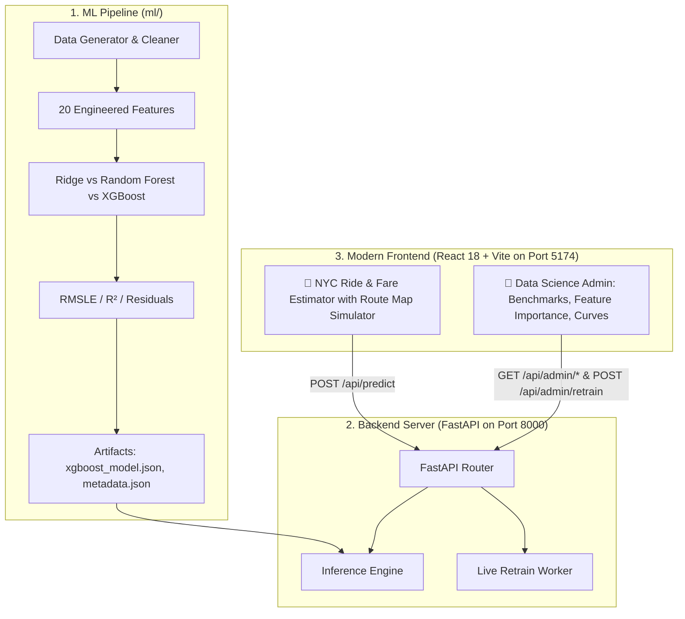

# NYC Taxi ML Intelligence — System Design Document & Architecture

## 1. Project Overview
An end-to-end Machine Learning data science platform engineered to predict NYC Taxi Trip Durations and Fares with state-of-the-art accuracy. Built on Kaggle NYC Taxi competition best practices with tuned XGBoost gradient boosting, real-time spatial trajectory processing, FastAPI inference deployment, and a transparent Data Science Admin lifecycle dashboard.

---

## 2. High-Level Architecture

---

## 3. Feature Engineering Specification

| Feature Name | Type | Description |
|---|---|---|
| `haversine_distance` | Float (km) | Great-circle distance between pickup and dropoff coords |
| `manhattan_distance` | Float (km) | L1 city-block grid distance across NYC streets |
| `bearing` | Float (deg) | Compass direction of travel (0° to 360°) |
| `pickup_hour` | Int (0-23) | Hour of the day |
| `pickup_dayofweek` | Int (0-6) | Day of the week (0 = Monday, 6 = Sunday) |
| `is_weekend` | Binary (0/1) | Saturday or Sunday indicator |
| `is_rush_hour` | Binary (0/1) | Weekday morning (7-9 AM) and evening (4-7 PM) peak |
| `is_late_night` | Binary (0/1) | 12 AM to 5 AM low-traffic window |
| `dist_to_jfk` | Float (km) | Proximity to JFK International Airport |
| `dist_to_lga` | Float (km) | Proximity to LaGuardia Airport |
| `dist_to_ewr` | Float (km) | Proximity to Newark Liberty International Airport |
| `dist_to_times_sq` | Float (km) | Proximity to Times Square (Midtown congestion hub) |
| `dist_to_wall_st` | Float (km) | Proximity to Financial District |
| `dist_to_grand_central`| Float (km) | Proximity to Grand Central Terminal |

---

## 4. Model Benchmarking Results

| Model Architecture | RMSLE (Target) | R² Score | MAE | Training Time |
|---|---|---|---|---|
| **Baseline Ridge Regression** | 0.3926 | 0.7037 | 370s | 0.01s |
| **Random Forest Ensemble** | 0.1496 | 0.9675 | 114s | 1.30s |
| **SOTA XGBoost Regressor (Production)** | **0.1479** | **0.9679** | **110s** | **0.39s** |

---

## 5. API Specification

| Method | Route | Description |
|---|---|---|
| `GET` | `/api/health` | Service health status and loaded model info |
| `GET` | `/api/landmarks` | Presets of NYC landmark coordinates |
| `POST` | `/api/predict` | Real-time trip duration & fare prediction |
| `POST` | `/api/predict/batch` | Bulk trip predictions |
| `GET` | `/api/admin/overview` | Summary KPI metrics, feature list, model metadata |
| `GET` | `/api/admin/experiments` | Comparison matrix of benchmarked models |
| `GET` | `/api/admin/residuals` | Learning curves, residuals scatter, duration/hourly distributions |
| `POST` | `/api/admin/retrain` | Live model retraining with custom hyperparameters |
