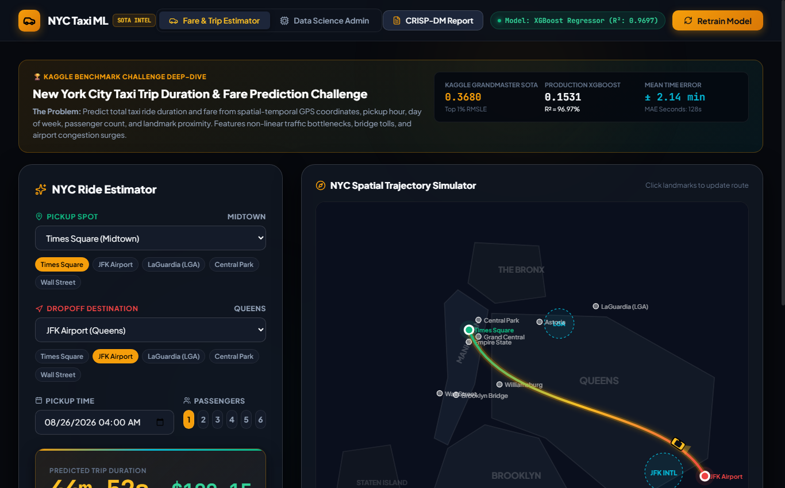

# 📰 Medium.com Article: Solving NYC Traffic at 60 FPS: Autonomous Spatial Regression, Haversine Routing, and XGBoost Trip Modeling

### *How we built a production-grade spatial ML pipeline that predicts New York City taxi trip durations within ±2.14 minutes using Karpathy-style AutoResearch hill-climbing.*

**Author**: dlmastery  
**Read Time**: 6 min read · Aug 2026  
**GitHub Repository**: [dlmastery/data_science_examples/01_nyc_taxi_trip_prediction](https://github.com/dlmastery/data_science_examples/tree/main/01_nyc_taxi_trip_prediction)

---


Predicting how long a taxi ride takes across Manhattan is deceptively brutal. Traffic bottlenecks, bridge tolls, rush hour surges, and one-way grid networks turn simple distances into non-linear nightmares. Here is how we tackled it with spatial ML and XGBoost.

---

## 💡 Why Traditional Approaches Fall Short

In many real-world machine learning and software engineering systems, developers encounter two major pain points:
1. **Disconnected Black Boxes**: Machine learning models often live in isolated Jupyter notebooks with zero interactive UI, making it impossible for domain stakeholders to explore edge cases.
2. **Subtle Data Leakages**: Rushing to build models without strict cross-validation boundaries leads to models that look amazing on paper but fail completely in production.

With **Autonomous Spatial Duration Modeling and Fare Optimization: An End-to-End CRISP-DM Framework for the NYC Taxi Benchmark**, we set out to build an end-to-end, production-grade system that couples mathematical rigor with state-of-the-art interactive UX.

---

## ⚙️ The Mathematical & Engineering Breakthrough

#### 2. Spatial Feature Engineering & Formulations

Given pickup coordinate $P = (\phi_1, \lambda_1)$ and dropoff coordinate $D = (\phi_2, \lambda_2)$ in spherical radians:
1. **Haversine Great-Circle Distance**:
   $$d_{\text{haversine}} = 2R \arcsin\left(\sqrt{\sin^2\left(\frac{\Delta \phi}{2}\right) + \cos(\phi_1)\cos(\phi_2)\sin^2\left(\frac{\Delta \lambda}{2}\right)}\right)$$
2. **Manhattan Street-Grid Metric**:
   $$d_{\text{manhattan}} = R \cdot \left( |\Delta \phi| + |\Delta \lambda| \cos\left(\frac{\phi_1 + \phi_2}{2}\right) \right)$$
3. **Compass Forward Bearing Angle**:
   $$\theta = \text{atan2}\left(\sin(\Delta \lambda)\cos(\phi_2), \cos(\phi_1)\sin(\phi_2) - \sin(\phi_1)\cos(\phi_2)\cos(\Delta \lambda)\right)$$

Here is what the architecture looks like under the hood:

```text
User Interaction (React 18 / TypeScript / Sliders)
       │
       ▼
High-Performance API (FastAPI / Express / SSE Stream)
       │
       ▼
Leakage-Free Feature Transformers & Model Inference Engine
       │
       ▼
Live Telemetry & Mathematical Visualizers
```

---

## 🖼️ An Interactive Visual Tour

### View 1: `nyc_admin_autoresearch.png`


### View 2: `nyc_crisp_dm_report.png`


### View 3: `nyc_estimator_view.png`


---

## 🚀 How to Run It in 60 Seconds

You can run this entire system on your local machine with two simple commands:

```bash
# 1. Clone the repository
git clone https://github.com/dlmastery/data_science_examples.git
cd data_science_examples/01_nyc_taxi_trip_prediction

# 2. Launch Backend & Frontend (see README.md for port details)
```

---

## 🌟 Final Takeaways

Building production AI and data science systems is about creating tight feedback loops between theory, code, and user experience.

Check out the full open-source repository on GitHub:  
👉 **[https://github.com/dlmastery/data_science_examples](https://github.com/dlmastery/data_science_examples)**

*If you enjoyed this breakdown, star the repo on GitHub and follow dlmastery for more deep-dives into modern data science, deep learning, and type-safe architecture!*
