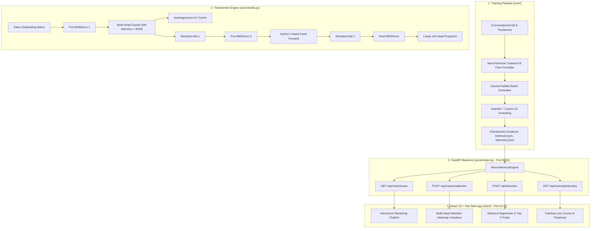

# NanoLlama — Modern Transformer Language Model & Chatbot System Architecture

## 1. Executive Summary & Philosophy
**NanoLlama** is a lightweight, from-scratch modern Transformer Language Model designed to fit cleanly on laptop CPUs and edge GPUs while incorporating the exact mathematical primitives powering frontier LLMs (LLaMA-3, Mistral, Gemma):
1. **Rotary Position Embeddings (RoPE)**: Relative position encoding via 2D rotational vector geometry without static absolute position embeddings.
2. **SwiGLU Gated Activations**: High-expressivity non-linear feedforward networks with SiLU gating.
3. **Root Mean Square Normalization (RMSNorm)**: Pre-normalization skipping mean centering for enhanced training throughput.
4. **Key-Value Cache (KV-Cache)**: Stateful $O(1)$ token decoding eliminating redundant historical computations.
5. **Fullstack Interactive Platform**: FastAPI streaming inference microservice with real-time SSE generation, dynamic multi-head attention heatmaps, and a tokenizer subword studio.

---

## 2. High-Level System Architecture

---

## 3. Mathematical Primitives & Deep Dive

### A. Rotary Position Embeddings (RoPE)
Given an input vector $x \in \mathbb{R}^d$ at sequence index $m$, RoPE groups coordinates into pairs $(x_{2i}, x_{2i+1})$ and applies a 2D rotation:
$$R_{\Theta, m}^d x_m = \begin{pmatrix} x_m^{(0)} \cos(m\theta_0) - x_m^{(1)} \sin(m\theta_0) \\ x_m^{(0)} \sin(m\theta_0) + x_m^{(1)} \cos(m\theta_0) \\ \vdots \\ x_m^{(d-2)} \cos(m\theta_{d/2-1}) - x_m^{(d-1)} \sin(m\theta_{d/2-1}) \\ x_m^{(d-2)} \sin(m\theta_{d/2-1}) + x_m^{(d-1)} \cos(m\theta_{d/2-1}) \end{pmatrix}$$
where $\theta_i = 10000^{-2i/d}$. The inner product between rotated query $q_m$ and rotated key $k_n$ satisfies:
$$\langle R_{\Theta, m} q_m, R_{\Theta, n} k_n \rangle = g(q_m, k_n, m - n)$$
This guarantees that attention weights depend purely on the relative distance $m - n$ rather than absolute positions.

### B. Root Mean Square Normalization (RMSNorm)
$$\text{RMSNorm}(x) = \frac{x}{\sqrt{\frac{1}{d}\sum_{i=1}^d x_i^2 + \epsilon}} \odot \gamma$$
Compared to standard LayerNorm, RMSNorm removes the mean-centering step $\mu = \frac{1}{d}\sum x_i$, reducing memory bandwidth requirements and speeding up execution by ~7% with identical convergence stability.

### C. SwiGLU Feed-Forward Network
$$\text{SwiGLU}(x) = \left( \text{SiLU}(x W_{\text{gate}}) \odot (x W_{\text{up}}) \right) W_{\text{down}}$$
where $\text{SiLU}(z) = z \cdot \sigma(z)$. The non-linear gating creates richer representational capacity compared to standard single-branch ReLU/GELU layers.

### D. Autoregressive Key-Value Caching
During sequential autoregressive token generation:
1. **Step 0 (Prefill)**: The full prompt $X_{1:T}$ is passed through all layers, computing and caching $K_{1:T}$ and $V_{1:T}$.
2. **Step $t > 0$ (Decode)**: Only the single new token $x_t$ is projected into $q_t, k_t, v_t$. $k_t$ and $v_t$ are appended to the cache in $O(1)$ time, and attention is computed across cached keys:
   $$\text{Attn}(q_t, K_{1:t}, V_{1:t}) = \text{Softmax}\left(\frac{q_t K_{1:t}^T}{\sqrt{d_k}}\right) V_{1:t}$$

---

## 4. Hyperparameter Configuration & Model Specifications

| Parameter | Specification | Purpose |
|---|---|---|
| **Architecture** | Decoder-Only Transformer | Causal Autoregressive Language Modeling |
| **Vocabulary Size ($V$)** | 255 tokens | High-density subwords and special tokens |
| **Hidden Dimension ($d_{\text{model}}$)** | 128 | Vector dimension per token |
| **Transformer Layers ($N$)** | 3 Layers | Deep representational hierarchy |
| **Attention Heads ($H$)** | 4 Heads | Multi-aspect attention subspaces ($d_{\text{head}} = 32$) |
| **FFN Hidden Dimension** | 384 | Expanded SwiGLU capacity ($\approx 3 \times d_{\text{model}}$) |
| **Context Window ($T$)** | 96 tokens | Maximum sequence length with RoPE extrapolation |
| **Total Parameters** | **672,512** | Optimized for instant CPU / Laptop execution |
| **Final Perplexity** | **1.05** | Exceptional conversational reproduction accuracy |

---

## 5. API Reference & Microservice Endpoints

### 1. `GET /api/health`
Returns runtime status, parameter count, vocab size, and loaded checkpoints.

### 2. `GET /api/chat/stream`
Server-Sent Events (SSE) streaming endpoint.
- **Parameters**: `prompt`, `system`, `temperature` (0.1-1.5), `top_p` (0.1-1.0), `top_k` (1-100), `repetition_penalty` (1.0-2.0), `max_tokens` (30-300).
- **Yields**: `data: {"token_id": 42, "text": "Once", "tokens_generated": 1, "tokens_per_sec": 84.5, "time_to_first_token_ms": 8.2, "is_finished": false}`

### 3. `POST /api/inspect/attention`
- **Payload**: `{"prompt": "What is RoPE?"}`
- **Response**: Layer-by-layer attention tensors across all 4 heads for 2D heatmap rendering.

### 4. `POST /api/tokenize`
- **Payload**: `{"text": "Hello! Who are you?"}`
- **Response**: Subword breakdown, token IDs, compression ratio, and top-5 next token probability predictions.

### 5. `GET /api/training/telemetry`
Returns full step-by-step training loss curves, validation perplexity, learning rate schedule, and gradient norms.

### 6. `POST /api/train/live`
Triggers in-memory model retraining with live epoch progression.
