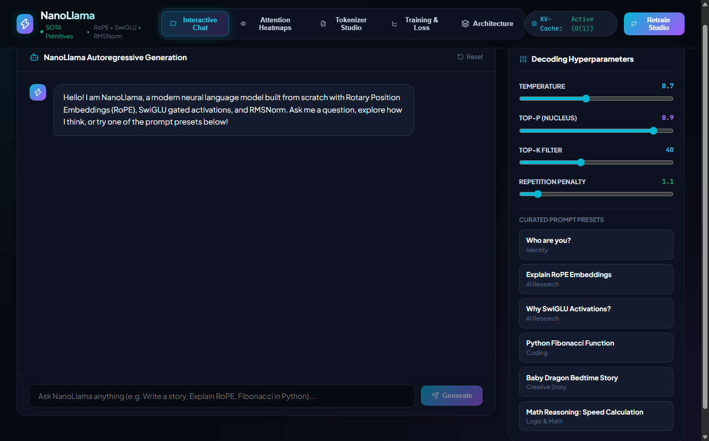

# ⚡ NanoLlama — Autoregressive SFT Language Model

A pure PyTorch autoregressive transformer neural network built entirely from scratch with **Rotary Position Embeddings (RoPE)**, **SwiGLU gated activations**, **RMSNorm**, and **Supervised Fine-Tuning (SFT)** with live KV-Cache generation, attention heatmaps, and tokenizer inspection.

---

## 📸 Comprehensive Visual Tour

### 1. Interactive Chat Studio & Real-time Text Generation
*Full-featured generative studio supporting Top-P Nucleus Sampling, Temperature, Repetition Penalty, and curated AI research prompt presets.*


### 2. Multi-Head Self-Attention Matrix Heatmaps
*Visualizes query-key attention distribution $A = \text{softmax}(QK^T / \sqrt{d_k})$ across multiple attention heads.*


### 3. Custom Tokenizer Studio
*Interactive BPE token decomposition showing token IDs, byte lengths, and token type color badges.*


### 4. Loss & Perplexity Training Telemetry
*Cross-Entropy loss tracking and Perplexity validation convergence curves across epochs.*


### 5. Neural Architecture Blueprint
*Comprehensive structural diagram detailing the forward pass through RoPE Multi-Head Attention and SwiGLU FFN blocks.*


---

## 📐 Transformer Primitives Implemented

1. **Rotary Position Embeddings (RoPE)**:
   $$R_{\Theta, m}^d x_m = \begin{pmatrix} x_m^{(1)} \cos m\theta_1 - x_m^{(2)} \sin m\theta_1 \\ x_m^{(1)} \sin m\theta_1 + x_m^{(2)} \cos m\theta_1 \\ \vdots \end{pmatrix}$$
2. **SwiGLU Activation Function**:
   $$\text{SwiGLU}(x) = \text{Swish}(x W) \otimes (x V)$$
3. **Root Mean Square Normalization (RMSNorm)**:
   $$\bar{a}_i = \frac{a_i}{\text{RMS}(a)} g_i, \quad \text{RMS}(a) = \sqrt{\frac{1}{d} \sum_{i=1}^d a_i^2 + \epsilon}$$

---

## 🧠 Autonomous Skills Included

Pre-packaged in `skills/` and `.agents/skills/`:
* `nano-llm-transformer`: Full architectural transformer pipeline.
* `pytorch-training-loop`: Reproducible training loop with mixed precision and gradient clipping.
* `llm-finetuning`: SFT dataset formatting and loss optimization.

---

## 🚀 Quick Start

```bash
# Backend (FastAPI on Port 8002)
cd backend
python -m uvicorn main:app --host 127.0.0.1 --port 8002

# Frontend (Vite React on Port 5175)
cd frontend
npm install
npm run dev # Open http://localhost:5175/
```
