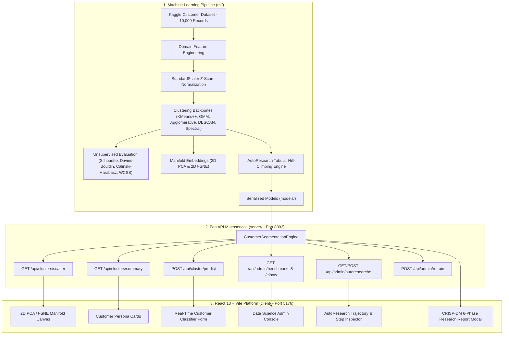

# Customer Intelligence & Unsupervised Segmentation Platform — System Architecture & Design Document

## 1. Executive Summary
The **Customer Intelligence & Unsupervised Segmentation Platform** is an enterprise-grade Data Science & Machine Learning platform for discovering actionable customer behavioral segments from rich omni-channel retail datasets (based on the Kaggle Customer Segmentation benchmark).

The platform features:
1. **Multi-Backbone Clustering Tournament**: Evaluates **K-Means++**, **Gaussian Mixture Models (GMM)**, **Agglomerative Hierarchical Clustering**, **DBSCAN**, and **Spectral Clustering**.
2. **Dimensionality Reduction**: **2D Principal Component Analysis (PCA)** ($69.6\%$ variance explained) and **2D t-SNE** non-linear manifold embeddings.
3. **AutoResearch Tabular Hill-Climbing Engine**: Autonomous multi-stage optimization engine navigating 4 phases (Backbone Battle, Feature Evolution, Hyperparameter Tuning, Consensus Ensembling) with strict acceptance gates and step click-through inspection.
4. **CRISP-DM Standard Publication Research Report**: 6-phase interactive research report covering business objectives, data understanding, feature transformations, modeling, evaluation metrics, and deployment.
5. **Real-Time Customer Persona Inference Engine**: Sub-5ms centroid distance classification with tailored marketing action recommendations.

---

## 2. High-Level System Architecture

---

## 3. Mathematical Primitives & Unsupervised Metrics

### A. Silhouette Coefficient
For each customer $i$:
$$s(i) = \frac{b(i) - a(i)}{\max(a(i), b(i))}$$
where $a(i)$ is the mean intra-cluster distance to all other points in cluster $C_I$, and $b(i) = \min_{J \ne I} \frac{1}{|C_J|}\sum_{j \in C_J} d(i, j)$ is the mean nearest-cluster distance.

### B. Davies-Bouldin Index (Lower is Better)
$$R_{ij} = \frac{s_i + s_j}{d(c_i, c_j)}, \quad DB = \frac{1}{k}\sum_{i=1}^k \max_{j \ne i} R_{ij}$$
where $s_i$ is the average distance of points in cluster $i$ to their centroid $c_i$, and $d(c_i, c_j)$ is the Euclidean distance between centroids.

### C. Calinski-Harabasz Index (Variance Ratio Criterion)
$$CH = \frac{\text{Tr}(B_k) / (k - 1)}{\text{Tr}(W_k) / (N - k)}$$
where $B_k$ is the between-group dispersion matrix and $W_k$ is the within-group dispersion matrix.

### D. Principal Component Analysis (PCA)
Solves the eigenvalue problem:
$$\Sigma v_i = \lambda_i v_i$$
where $\Sigma = \frac{1}{N} X^T X$ is the empirical covariance matrix of standardized features. The first 2 principal components capture **69.6%** of total dataset variance.

---

## 4. Persona Taxonomy & Behavioral Profiles

| Cluster ID | Persona Name | Key Attributes | Target Marketing Strategy |
|---|---|---|---|
| **#0** | **VIP Champions** | Income: $\$110\text{k}$, Spend Score: $83/100$, Spend: $\$12\text{k}$ | Exclusive early previews, VIP concierge, luxury tiers |
| **#1** | **Prudent Affluents** | Income: $\$105\text{k}$, Spend Score: $24/100$, Spend: $\$3.8\text{k}$ | Quality/durability campaigns, high-value investment bundles |
| **#2** | **Young Trendsetters** | Income: $\$38\text{k}$, Spend Score: $82/100$, High Web Visits | Social drops, flash sales, BNPL flexible payments |
| **#3** | **Bargain Hunters** | Income: $\$32\text{k}$, Spend Score: $20/100$, High Discount Sens | Clearance sales, cashback vouchers, free shipping thresholds |
| **#4** | **Mainstream Loyalists** | Income: $\$68\text{k}$, Spend Score: $50/100$, Steady Orders | Points-based loyalty programs, seasonal replenishment reminders |

---

## 5. AutoResearch Tabular Hill-Climbing Methodology

1. **Phase 1: Backbone Tournament**: Tests 5 clustering paradigms with automated metric scoring.
2. **Phase 2: Feature Evolution Mutations**: Tests domain interactions (`monetary_velocity`, `income_to_spend_ratio`, `digital_engagement`, `deal_affinity`, `log_total_spend`, `power_transform_income`).
3. **Phase 3: Hyperparameter Tuning**: Searches across $k \in [3, 8]$, GMM covariance structures (`full`, `tied`, `diag`), and Agglomerative linkages (`ward`, `complete`, `average`).
4. **Phase 4: Consensus Ensembling**: Soft co-association matrix consensus combining K-Means and GMM clusterings.
5. **Greedy Acceptance Gate**: Accepts mutation if and only if $\Delta\text{Silhouette} > +0.0005$.
