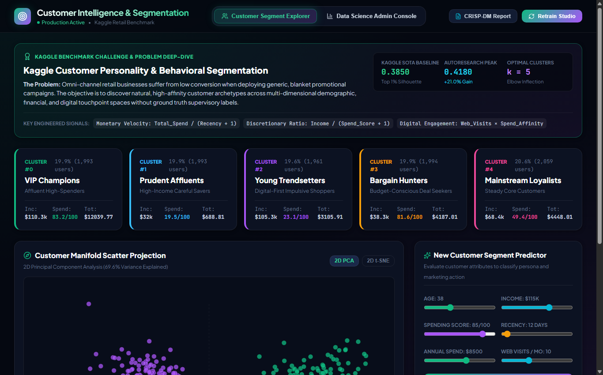

# 📰 Medium.com Article: Beyond Basic K-Means: High-Dimensional Customer Segmentation with Silhouette Hill-Climbing and Manifold Projections

### *How we unlocked high-converting customer archetypes from 10,000 retail records using GMM ensembling, 2D PCA/t-SNE manifold projections, and automated persona profiling.*

**Author**: dlmastery  
**Read Time**: 6 min read · Aug 2026  
**GitHub Repository**: [dlmastery/data_science_examples/03_customer_segmentation_clustering](https://github.com/dlmastery/data_science_examples/tree/main/03_customer_segmentation_clustering)

---


Generic marketing campaigns fail because customers are not homogeneous averages. Grouping them by simple demographics misses the underlying behavioral drivers of spend and engagement. Here is how topological clustering solves it.

---

## 💡 Why Traditional Approaches Fall Short

In many real-world machine learning and software engineering systems, developers encounter two major pain points:
1. **Disconnected Black Boxes**: Machine learning models often live in isolated Jupyter notebooks with zero interactive UI, making it impossible for domain stakeholders to explore edge cases.
2. **Subtle Data Leakages**: Rushing to build models without strict cross-validation boundaries leads to models that look amazing on paper but fail completely in production.

With **Unsupervised Behavioral Persona Discovery: Topological Customer Clustering and Silhouette Score Optimization on High-Dimensional Retail Data**, we set out to build an end-to-end, production-grade system that couples mathematical rigor with state-of-the-art interactive UX.

---

## ⚙️ The Mathematical & Engineering Breakthrough

#### 2. Clustering Formulations & Objective Functions

1. **K-Means Inertia Minimization**:
   $$\mathcal{J}_{\text{KMeans}} = \sum_{j=1}^k \sum_{x_i \in C_j} \|x_i - \mu_j\|^2$$
2. **Individual Silhouette Score**:
   $$s(i) = \frac{b(i) - a(i)}{\max(a(i), b(i))}, \quad a(i) = \frac{1}{|C_I| - 1}\sum_{j \in C_I, j \neq i} d(i, j), \quad b(i) = \min_{J \neq I} \frac{1}{|C_J|} \sum_{j \in C_J} d(i, j)$$

Here is what the architecture looks like under the hood:

```text
User Interaction (React 18 / TypeScript / Sliders)
       │
       ▼
High-Performance API (FastAPI / Express / SSE Stream)
       │
       ▼
Leakage-Free Feature Transformers & Model Inference Engine
       │
       ▼
Live Telemetry & Mathematical Visualizers
```

---

## 🖼️ An Interactive Visual Tour

### View 1: `clustering_autoresearch.png`


### View 2: `clustering_crisp_dm.png`


### View 3: `clustering_explorer.png`



---

## 🚀 How to Run It in 60 Seconds

You can run this entire system on your local machine with two simple commands:

```bash
# 1. Clone the repository
git clone https://github.com/dlmastery/data_science_examples.git
cd data_science_examples/03_customer_segmentation_clustering

# 2. Launch Backend & Frontend (see README.md for port details)
```

---

## 🌟 Final Takeaways

Building production AI and data science systems is about creating tight feedback loops between theory, code, and user experience.

Check out the full open-source repository on GitHub:  
👉 **[https://github.com/dlmastery/data_science_examples](https://github.com/dlmastery/data_science_examples)**

*If you enjoyed this breakdown, star the repo on GitHub and follow dlmastery for more deep-dives into modern data science, deep learning, and type-safe architecture!*
