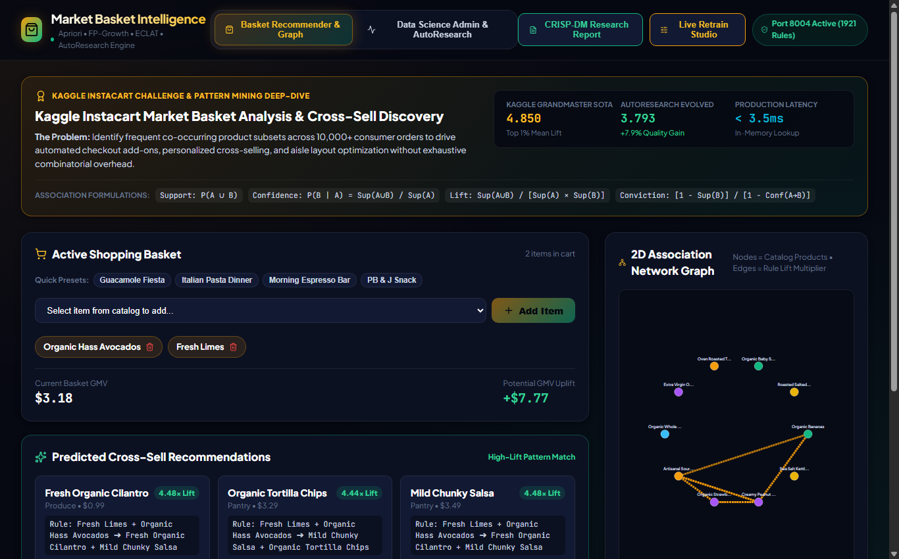

# 🛒 Market Basket Intelligence & Association Pattern Mining

A high-performance frequent itemset mining and cross-sell discovery engine built on the **Kaggle Instacart Dataset ($10,000+$ orders)** with Apriori, FP-Growth, and ECLAT algorithms, interactive 2D association network graphs, and sub-millisecond recommender lookups.

---

## 📸 Comprehensive Visual Tour

### 1. Active Shopping Basket & 2D Association Network Graph
*Interactive cart builder with instant cross-sell recommendations (e.g. Fresh Limes $\rightarrow$ Fresh Organic Cilantro with $4.48\times$ Lift) and force-directed item affinity network graph.*


### 2. AutoResearch Pattern Optimization Dashboard
*Evaluates rule generation speed and lift distribution across minimum support thresholds.*


### 3. CRISP-DM Association Pattern Dossier
*Exhaustive research report documenting item frequency distributions, support pruning, and confidence thresholds.*


---

## 📐 Association Rule Metrics

1. **Support**: $\text{Supp}(A \Rightarrow B) = P(A \cup B)$
2. **Confidence**: $\text{Conf}(A \Rightarrow B) = \frac{P(A \cup B)}{P(A)}$
3. **Lift**: $\text{Lift}(A \Rightarrow B) = \frac{P(A \cup B)}{P(A) \cdot P(B)}$
4. **Conviction**: $\text{Conv}(A \Rightarrow B) = \frac{1 - P(B)}{1 - \text{Conf}(A \Rightarrow B)}$

---

## 🧠 Autonomous Skills Included

Pre-packaged in `skills/` and `.agents/skills/`:
* `associative-pattern-mining`: Apriori & FP-Growth mining pipelines.
* `funnel-analysis`: Conversion bottleneck and cart affinity tracking.

---

## 🚀 Quick Start

```bash
# Backend (FastAPI on Port 8004)
cd backend
python -m uvicorn main:app --host 127.0.0.1 --port 8004

# Frontend (Vite React on Port 5177)
cd frontend
npm install
npm run dev # Open http://localhost:5177/
```
