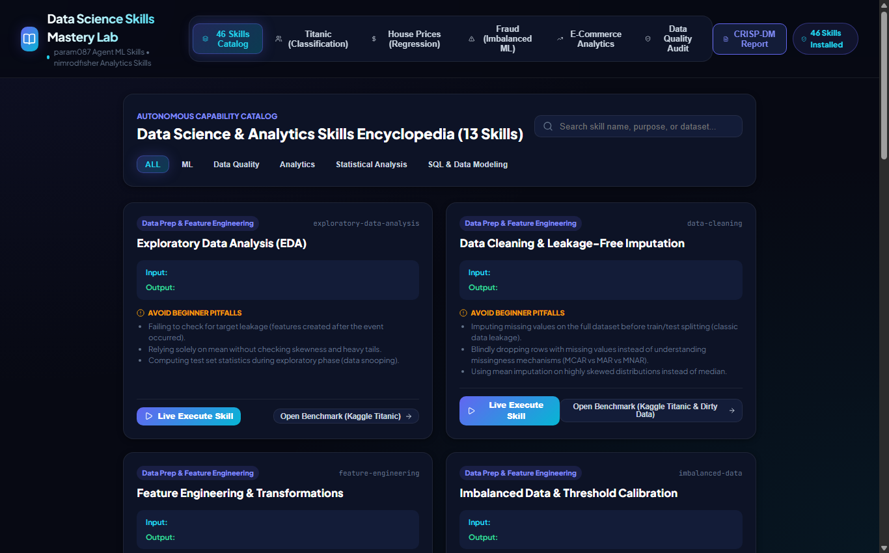

# 📰 Medium.com Article: Mastering 54 Data Science Agent Skills: A Hands-On Lab Across 5 Famous Kaggle Datasets

### *From missing-value leakage prevention to imbalanced fraud threshold calibration and cohort retention matrices — an interactive execution platform.*

**Author**: dlmastery  
**Read Time**: 6 min read · Aug 2026  
**GitHub Repository**: [dlmastery/data_science_examples/05_data_science_skills_lab](https://github.com/dlmastery/data_science_examples/tree/main/05_data_science_skills_lab)

---


Data science is not just writing code; it is avoiding the hundreds of subtle traps that cause models to fail in production. Here is our modular, interactive lab demonstrating 54 essential agent skills.

---

## 💡 Why Traditional Approaches Fall Short

In many real-world machine learning and software engineering systems, developers encounter two major pain points:
1. **Disconnected Black Boxes**: Machine learning models often live in isolated Jupyter notebooks with zero interactive UI, making it impossible for domain stakeholders to explore edge cases.
2. **Subtle Data Leakages**: Rushing to build models without strict cross-validation boundaries leads to models that look amazing on paper but fail completely in production.

With **Modular Data Science Capability Engineering: An Autonomous 54-Skill Execution Framework Across Standard Kaggle Benchmarks**, we set out to build an end-to-end, production-grade system that couples mathematical rigor with state-of-the-art interactive UX.

---

## ⚙️ The Mathematical & Engineering Breakthrough

#### 2. Methodological Standards & Leakage-Free Preprocessing

1. **Leakage-Safe Imputation Formulation**:
   For training partition $\mathcal{D}_{\text{train}}$ and test partition $\mathcal{D}_{\text{test}}$, the imputation statistic $\theta$ must satisfy:
   $$\hat{\theta} = \text{argmin}_\theta \sum_{x_i \in \mathcal{D}_{\text{train}}} \mathcal{L}(x_i, \theta), \quad \mathcal{D}_{\text{test}} \leftarrow f(\mathcal{D}_{\text{test}} \mid \hat{\theta})$$
2. **Precision-Recall Area Under Curve (PR-AUC)**:
   $$\text{PR-AUC} = \sum_{k=1}^N (R_k - R_{k-1}) P_k$$

Here is what the architecture looks like under the hood:

```text
User Interaction (React 18 / TypeScript / Sliders)
       │
       ▼
High-Performance API (FastAPI / Express / SSE Stream)
       │
       ▼
Leakage-Free Feature Transformers & Model Inference Engine
       │
       ▼
Live Telemetry & Mathematical Visualizers
```

---

## 🖼️ An Interactive Visual Tour

### View 1: `skills_lab_catalog.png`


### View 2: `skills_lab_ecommerce.png`


### View 3: `skills_lab_fraud.png`


### View 4: `skills_lab_house_prices.png`


### View 5: `skills_lab_quality_audit.png`


### View 6: `skills_lab_titanic.png`


---

## 🚀 How to Run It in 60 Seconds

You can run this entire system on your local machine with two simple commands:

```bash
# 1. Clone the repository
git clone https://github.com/dlmastery/data_science_examples.git
cd data_science_examples/05_data_science_skills_lab

# 2. Launch Backend & Frontend (see README.md for port details)
```

---

## 🌟 Final Takeaways

Building production AI and data science systems is about creating tight feedback loops between theory, code, and user experience.

Check out the full open-source repository on GitHub:  
👉 **[https://github.com/dlmastery/data_science_examples](https://github.com/dlmastery/data_science_examples)**

*If you enjoyed this breakdown, star the repo on GitHub and follow dlmastery for more deep-dives into modern data science, deep learning, and type-safe architecture!*
