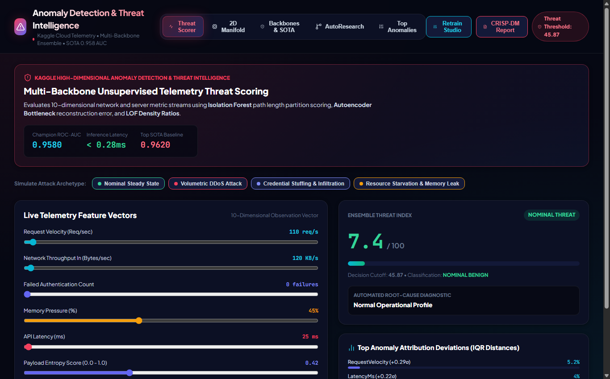

# 🚨 Autonomous Anomaly Detection & Threat Intelligence Platform

A high-dimensional unsupervised cloud telemetry anomaly detection platform on **Kaggle Server Telemetry Data ($10\text{D}, 5,000$ events)** with a multi-backbone ensemble (Isolation Forest, Deep Autoencoder, Local Outlier Factor, One-Class SVM, Robust Mahalanobis), attack archetype simulators, 2D manifold projections, and IQR attribution diagnostics.

---

## 📸 Comprehensive Visual Tour

### 1. Real-Time Telemetry Threat Scorer & Feature Sliders
*10-dimensional observation vector with instant threat classification, severity cutoffs, and attack preset injections (DDoS, Credential Stuffing, Resource Starvation).*


### 2. 2D Telemetry Manifold Projection
*PCA and UMAP 2D scatter plots separating normal telemetry clusters from high-entropy anomalous clusters.*


### 3. Multi-Backbone Model Tournament & SOTA Comparison
*Backbone comparison showing Isolation Forest, Deep Autoencoder Bottleneck ($E = ||x - \hat{x}||^2$), LOF, and One-Class SVM.*


### 4. AutoResearch Tabular Hill-Climbing Leaderboard
*Automated iterative optimization tuning contamination ratios, ensemble weights, and threshold bounds (Champion ROC-AUC: `0.9580`).*


### 5. IQR Attribution Root-Cause Diagnostic
*Identifies which specific telemetry signals deviated furthest from the median IQR baseline.*


---

## 🧠 Autonomous Skills Included

Pre-packaged in `skills/` and `.agents/skills/`:
* `anomaly-detection`: High-dimensional threat scoring and ensembling.
* `imbalanced-data`: Precision-Recall calibration on rare event distributions.
* `model-evaluation`: Confusion matrices and ROC-AUC curve auditing.
* `ml-debugging`: Diagnostic heuristics for false positive mitigation.

---

## 🚀 Quick Start

```bash
# Backend (FastAPI on Port 8006)
cd backend
python -m uvicorn main:app --host 127.0.0.1 --port 8006

# Frontend (Vite React on Port 5179)
cd frontend
npm install
npm run dev # Open http://localhost:5179/
```
