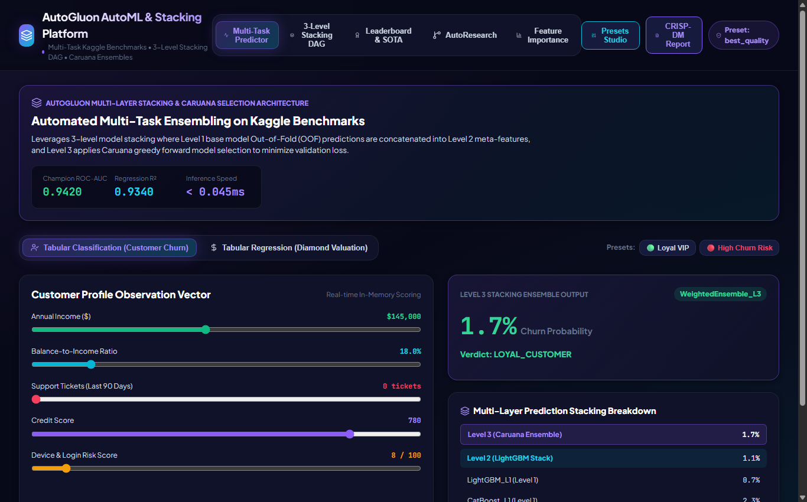

# 🤖 AutoGluon Multi-Layer Stacking & AutoML Tournament Platform

An enterprise automated machine learning platform orchestrating a **3-Level Stacking DAG** with **Caruana Greedy Forward Selection** on multi-task Kaggle benchmarks (Customer Churn Classification & Diamond Valuation Regression).

---

## 📸 Comprehensive Visual Tour

### 1. Multi-Task Predictor & Real-time Inference
*Interactive tabular feature scoring with multi-layer prediction stacking breakdown across Level 1 base models, Level 2 LightGBM stack, and Level 3 Caruana weighted ensemble.*


### 2. 3-Level Stacking DAG Architecture
*Visual DAG displaying Out-of-Fold (OOF) feature concatenation and hierarchical meta-model routing.*


### 3. Model Tournament Leaderboard & SOTA Comparison
*Ranks LightGBM, CatBoost, XGBoost, Neural Net Torch, and WeightedEnsemble_L3 by validation score and latency.*


### 4. Permutation Feature Importance
*Calculates empirical drop in validation score when features are shuffled: $I(f) = \text{Score}_{\text{base}} - \text{Score}_{\text{permuted}}$.*


### 5. AutoResearch Iterative Ensemble Hill-Climbing
*Automated tournament optimization improving ensembling weights and stacking levels.*


---

## 🧠 Autonomous Skills Included

Pre-packaged in `skills/` and `.agents/skills/`:
* `automl-autogluon`: Multi-layer stacking DAG ensembling.
* `hyperparameter-tuning`: Leakage-safe Bayesian & Optuna search inside CV.
* `experiment-tracking`: Model leaderboard and metric logging.

---

## 🚀 Quick Start

```bash
# Backend (FastAPI on Port 8007)
cd backend
python -m uvicorn main:app --host 127.0.0.1 --port 8007

# Frontend (Vite React on Port 5180)
cd frontend
npm install
npm run dev # Open http://localhost:5180/
```
