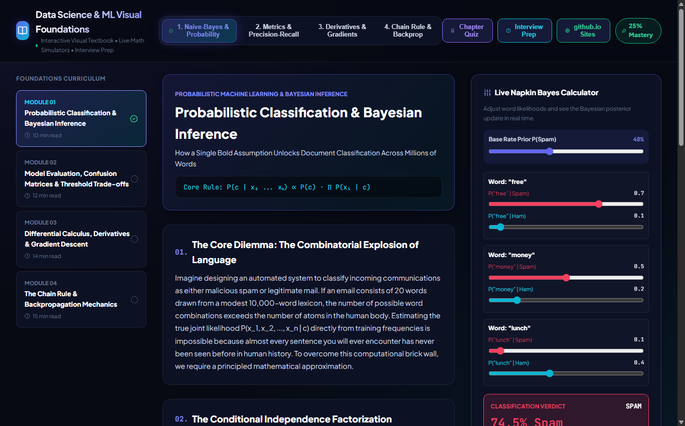

# 🎓 Data Science & Machine Learning Visual Foundations

An interactive visual curriculum and textbook teaching foundational ML and Data Science concepts with real-time mathematical simulators, interactive chapter quizzes, and interview flashcards.

---

## 📸 Comprehensive Visual Tour

### 1. Module 1: Probabilistic Classification & Live Napkin Bayes
*Explains the conditional independence assumption with an interactive Spam/Ham prior and likelihood slider simulator.*


### 2. Module 2: Model Evaluation, Confusion Matrices & PR Curves
*Interactive classification threshold slider demonstrating the fundamental Trade-off between Precision and Recall.*


### 3. Module 3: Differential Calculus, Derivatives & Gradient Descent
*Interactive tangent slope visualizer and gradient descent step simulator.*


### 4. Module 4: Chain Rule & Backpropagation Mechanics
*Forward and backward pass step simulator through computational graphs.*


### 5. Interactive Master's Chapter Quiz Modal
*Multi-question conceptual quizzes reinforcing each module with immediate explanation feedback.*


### 6. Interview Prep Flashcard Deck
*High-yield data science interview flashcards covering core theoretical concepts.*


---

## 🧠 Autonomous Skills Included

Pre-packaged in `skills/` and `.agents/skills/`:
* `data-science-mastery`: Foundational curriculum builder.
* `visualization-builder`: Dynamic visual math simulator components.
* `reproducible-ml`: Deterministic mathematical proof implementations.

---

## 🚀 Quick Start

```bash
# Backend (FastAPI on Port 8008)
cd backend
python -m uvicorn main:app --host 127.0.0.1 --port 8008

# Frontend (Vite React on Port 5181)
cd frontend
npm install
npm run dev # Open http://localhost:5181/
```
