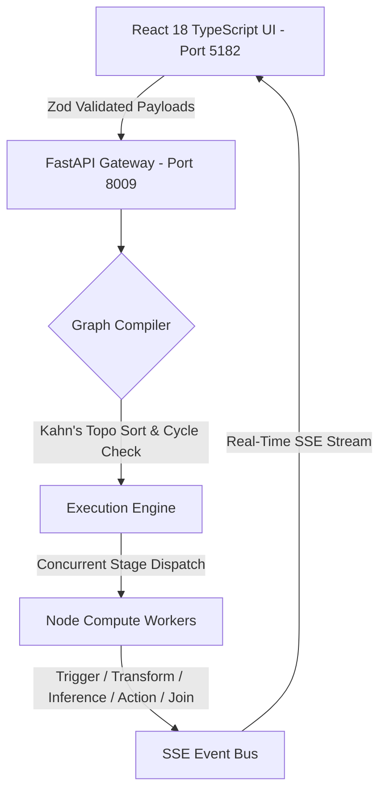

# FlowForge Architecture Document
*Built according to Matt Pocock Full-Stack & TypeScript Methodology*

## 1. System Intent & High-Level Scope
**FlowForge** is a high-reliability, type-safe autonomous workflow DAG (Directed Acyclic Graph) orchestration platform designed to model, validate, compile, and execute enterprise telemetry pipelines, AutoML stacking DAGs, and AI agent flows.

### Core Guarantees:
1. **Zero-Implicit Any & Exhaustive Type Narrowing**: Every domain object is strictly typed with branded types, discriminated unions, and finite state machines.
2. **Kahn's Topological Cycle Detection**: Graph compilation prevents cyclic deadlocks at validation time before any compute executes.
3. **Reactive Server-Sent Events (SSE) Streaming**: Full bidirectional visibility with live token/event throughput, concurrency levels, and node latencies.
4. **Deterministic State Transitions**: State machines prevent illegal transitions (e.g. running a failed or uncompiled workflow).

---

## 2. Component Hierarchy & Data Flow

---

## 3. Matt Pocock TypeScript Design Patterns

| Pattern | Implementation File | Architectural Role |
| :--- | :--- | :--- |
| **Branded Types** | `src/types/domain.ts` | Prevents ID cross-contamination (`WorkflowId`, `NodeId`, `RunId`). |
| **Discriminated Unions** | `src/types/domain.ts` | Dispatches heterogeneous node types (`trigger`, `transform`, `inference`, etc.). |
| **Exhaustive Matching** | `src/utils/assertNever.ts` | Compile-time proof that every node kind and engine state is handled. |
| **Finite State Machine** | `src/machines/workflowMachine.ts` | Formal state transition table (`idle` $\to$ `validating` $\to$ `compiling` $\to$ `running` $\to$ `completed` \| `failed`). |
| **Result<T, E> Pattern** | `src/utils/result.ts` | Functional error handling eliminating unhandled runtime promise rejections. |
| **Runtime Zod Boundary** | `src/schemas/workflow.schema.ts` | Validates untrusted network JSON and guarantees alignment with TypeScript types. |
