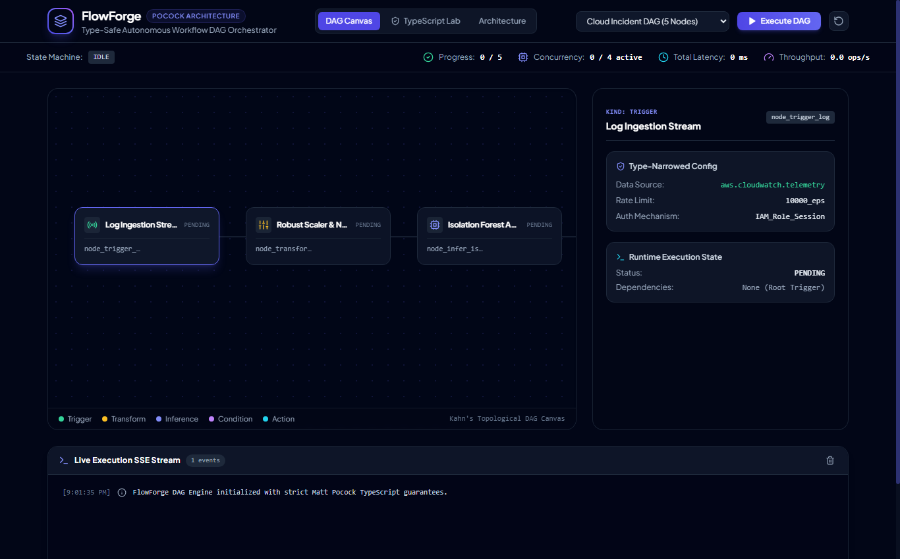

# 📰 Medium.com Article: Building FlowForge: Extreme TypeScript Type Safety and Kahn's DAG Orchestration in Full-Stack Web Apps

### *Nominal branded types, discriminated unions, exhaustive assertNever narrowing, and real-time SSE execution telemetry.*

**Author**: dlmastery  
**Read Time**: 6 min read · Aug 2026  
**GitHub Repository**: [dlmastery/data_science_examples/09_flowforge_dag_engine](https://github.com/dlmastery/data_science_examples/tree/main/09_flowforge_dag_engine)

---



TypeScript's type system is capable of catching complex architectural bugs at compile time if you know how to use nominal branding and discriminated unions. Here is how we applied Matt Pocock's master patterns to build a production DAG engine.

---

## 💡 Why Traditional Approaches Fall Short

In many real-world machine learning and software engineering systems, developers encounter two major pain points:
1. **Disconnected Black Boxes**: Machine learning models often live in isolated Jupyter notebooks with zero interactive UI, making it impossible for domain stakeholders to explore edge cases.
2. **Subtle Data Leakages**: Rushing to build models without strict cross-validation boundaries leads to models that look amazing on paper but fail completely in production.

With **Type-Safe Autonomous Workflow Orchestration: Implementing Matt Pocock Architectural Patterns and Kahn's Topological Sorting in TypeScript**, we set out to build an end-to-end, production-grade system that couples mathematical rigor with state-of-the-art interactive UX.

---

## ⚙️ The Mathematical & Engineering Breakthrough

#### 2. Graph Theory & Kahn's Topological Sort Algorithm

Let $G = (V, E)$ be a directed graph where $V$ represents workflow nodes and $E \subseteq V \times V$ represents execution dependencies.
1. **In-Degree Calculation**:
   $$\text{in-degree}(v) = |\{u \in V \mid (u, v) \in E\}|$$
2. **Kahn's Topological Ordering**:
   * Queue $Q \leftarrow \{v \in V \mid \text{in-degree}(v) = 0\}$
   * Pop $u \in Q$, append to sorted order $L$, decrement child in-degrees.

Here is what the architecture looks like under the hood:

```text
User Interaction (React 18 / TypeScript / Sliders)
       │
       ▼
High-Performance API (FastAPI / Express / SSE Stream)
       │
       ▼
Leakage-Free Feature Transformers & Model Inference Engine
       │
       ▼
Live Telemetry & Mathematical Visualizers
```

---

## 🖼️ An Interactive Visual Tour

### View 1: `flowforge_architecture_doc.png`


### View 2: `flowforge_dag_canvas.png`


### View 3: `flowforge_typescript_lab.png`


---

## 🚀 How to Run It in 60 Seconds

You can run this entire system on your local machine with two simple commands:

```bash
# 1. Clone the repository
git clone https://github.com/dlmastery/data_science_examples.git
cd data_science_examples/09_flowforge_dag_engine

# 2. Launch Backend & Frontend (see README.md for port details)
```

---

## 🌟 Final Takeaways

Building production AI and data science systems is about creating tight feedback loops between theory, code, and user experience.

Check out the full open-source repository on GitHub:  
👉 **[https://github.com/dlmastery/data_science_examples](https://github.com/dlmastery/data_science_examples)**

*If you enjoyed this breakdown, star the repo on GitHub and follow dlmastery for more deep-dives into modern data science, deep learning, and type-safe architecture!*
