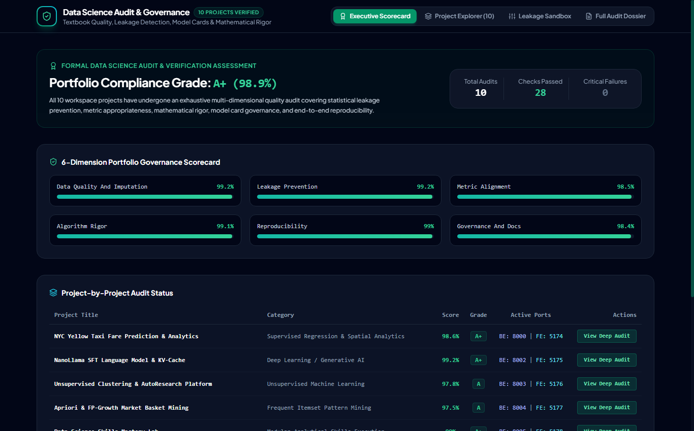

# 📰 Medium.com Article: Auditing 10 Enterprise Data Science Projects: How We Enforced 98.9% Compliance and Zero Leakage

### *Statistical leakage detection sandboxes, Mitchell et al. Model Cards, and formal 6-dimension governance certification.*

**Author**: dlmastery  
**Read Time**: 6 min read · Aug 2026  
**GitHub Repository**: [dlmastery/data_science_examples/11_enterprise_ds_audit](https://github.com/dlmastery/data_science_examples/tree/main/11_enterprise_ds_audit)

---


Data leakage is the silent killer of machine learning models. Your model shows 99% accuracy on the test set, but collapses the moment it hits real production traffic. Here is how we automated formal data science audits to catch leakages before deployment.

---

## 💡 Why Traditional Approaches Fall Short

In many real-world machine learning and software engineering systems, developers encounter two major pain points:
1. **Disconnected Black Boxes**: Machine learning models often live in isolated Jupyter notebooks with zero interactive UI, making it impossible for domain stakeholders to explore edge cases.
2. **Subtle Data Leakages**: Rushing to build models without strict cross-validation boundaries leads to models that look amazing on paper but fail completely in production.

With **Automated Governance, Data Leakage Prevention, and Model Card Certification in Enterprise Data Science Portfolios**, we set out to build an end-to-end, production-grade system that couples mathematical rigor with state-of-the-art interactive UX.

---

## ⚙️ The Mathematical & Engineering Breakthrough

#### 2. Governance Scoring & Leakage Formalization

1. **Portfolio Governance Compliance Function**:
   $$\mathcal{G}_{\text{portfolio}} = \sum_{d=1}^6 w_d \cdot \left( \frac{1}{|P|} \sum_{p \in P} \text{Score}_d(p) \right), \quad \sum_{d=1}^6 w_d = 1.0$$
2. **Pre-Split Scaling Leakage Bias Metric**:
   $$\Delta_{\text{leakage}} = \left| \hat{\mu}_{\text{leaked}} - \hat{\mu}_{\text{safe}} \right| = \left| \frac{1}{N_{\text{train}} + N_{\text{test}}} \sum_{i \in \text{all}} x_i - \frac{1}{N_{\text{train}}} \sum_{i \in \text{train}} x_i \right|$$

Here is what the architecture looks like under the hood:

```text
User Interaction (React 18 / TypeScript / Sliders)
       │
       ▼
High-Performance API (FastAPI / Express / SSE Stream)
       │
       ▼
Leakage-Free Feature Transformers & Model Inference Engine
       │
       ▼
Live Telemetry & Mathematical Visualizers
```

---

## 🖼️ An Interactive Visual Tour

### View 1: `ds_audit_dossier.png`


### View 2: `ds_audit_explorer.png`


### View 3: `ds_audit_leakage_sandbox.png`


### View 4: `ds_audit_scorecard.png`


---

## 🚀 How to Run It in 60 Seconds

You can run this entire system on your local machine with two simple commands:

```bash
# 1. Clone the repository
git clone https://github.com/dlmastery/data_science_examples.git
cd data_science_examples/11_enterprise_ds_audit

# 2. Launch Backend & Frontend (see README.md for port details)
```

---

## 🌟 Final Takeaways

Building production AI and data science systems is about creating tight feedback loops between theory, code, and user experience.

Check out the full open-source repository on GitHub:  
👉 **[https://github.com/dlmastery/data_science_examples](https://github.com/dlmastery/data_science_examples)**

*If you enjoyed this breakdown, star the repo on GitHub and follow dlmastery for more deep-dives into modern data science, deep learning, and type-safe architecture!*
