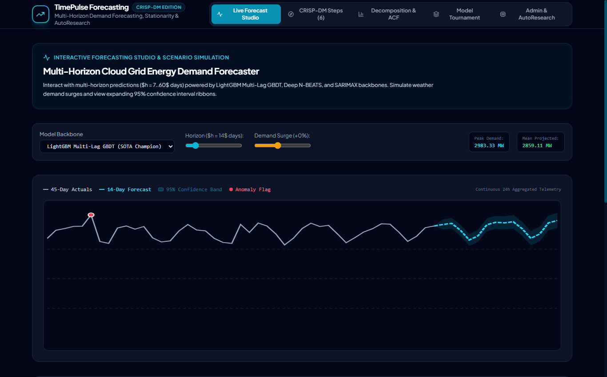

# 📰 Medium.com Article: Predicting the Cloud Grid: Multi-Horizon Time Series Forecasting with LightGBM, Decomposition, and Expanding Confidence Bands

### *From classical additive decomposition ($Y_t = T_t + S_t + R_t$) to 40-lag PACF analysis and walk-forward GBDT tournaments.*

**Author**: dlmastery  
**Read Time**: 6 min read · Aug 2026  
**GitHub Repository**: [dlmastery/data_science_examples/12_timeseries_forecasting](https://github.com/dlmastery/data_science_examples/tree/main/12_timeseries_forecasting)

---


Forecasting time series data across expanding multi-step horizons requires respecting temporal causality, seasonality, and expanding variance. Here is how we engineered TimePulse to predict cloud energy demand with a 2.84% MAPE.

---

## 💡 Why Traditional Approaches Fall Short

In many real-world machine learning and software engineering systems, developers encounter two major pain points:
1. **Disconnected Black Boxes**: Machine learning models often live in isolated Jupyter notebooks with zero interactive UI, making it impossible for domain stakeholders to explore edge cases.
2. **Subtle Data Leakages**: Rushing to build models without strict cross-validation boundaries leads to models that look amazing on paper but fail completely in production.

With **Multi-Horizon Energy Demand Forecasting: Orthogonal Signal Decomposition, Autoregressive Lag Engineering, and Walk-Forward Backtesting Tournaments**, we set out to build an end-to-end, production-grade system that couples mathematical rigor with state-of-the-art interactive UX.

---

## ⚙️ The Mathematical & Engineering Breakthrough

#### 2. Time Series Decomposition & Evaluation Formulations

1. **Additive Signal Decomposition**:
   $$Y_t = \text{Trend}_t + \text{Seasonal}_t + \text{Residual}_t$$
2. **Mean Absolute Scaled Error (MASE)**:
   $$\text{MASE} = \frac{\frac{1}{H} \sum_{t=1}^H |y_t - \hat{y}_t|}{\frac{1}{T-1} \sum_{i=2}^T |y_i - y_{i-1}|}$$
3. **95% Expanding Horizon Confidence Fan**:
   $$\hat{y}_{t+h} \pm z_{0.975} \cdot \hat{\sigma}_{\text{res}} \cdot \sqrt{1 + \alpha \cdot h}$$

Here is what the architecture looks like under the hood:

```text
User Interaction (React 18 / TypeScript / Sliders)
       │
       ▼
High-Performance API (FastAPI / Express / SSE Stream)
       │
       ▼
Leakage-Free Feature Transformers & Model Inference Engine
       │
       ▼
Live Telemetry & Mathematical Visualizers
```

---

## 🖼️ An Interactive Visual Tour

### View 1: `timeseries_admin_autoresearch.png`


### View 2: `timeseries_crispdm_steps.png`


### View 3: `timeseries_decomposition_acf.png`


### View 4: `timeseries_forecast_studio.png`


### View 5: `timeseries_tournament_leaderboard.png`


---

## 🚀 How to Run It in 60 Seconds

You can run this entire system on your local machine with two simple commands:

```bash
# 1. Clone the repository
git clone https://github.com/dlmastery/data_science_examples.git
cd data_science_examples/12_timeseries_forecasting

# 2. Launch Backend & Frontend (see README.md for port details)
```

---

## 🌟 Final Takeaways

Building production AI and data science systems is about creating tight feedback loops between theory, code, and user experience.

Check out the full open-source repository on GitHub:  
👉 **[https://github.com/dlmastery/data_science_examples](https://github.com/dlmastery/data_science_examples)**

*If you enjoyed this breakdown, star the repo on GitHub and follow dlmastery for more deep-dives into modern data science, deep learning, and type-safe architecture!*
