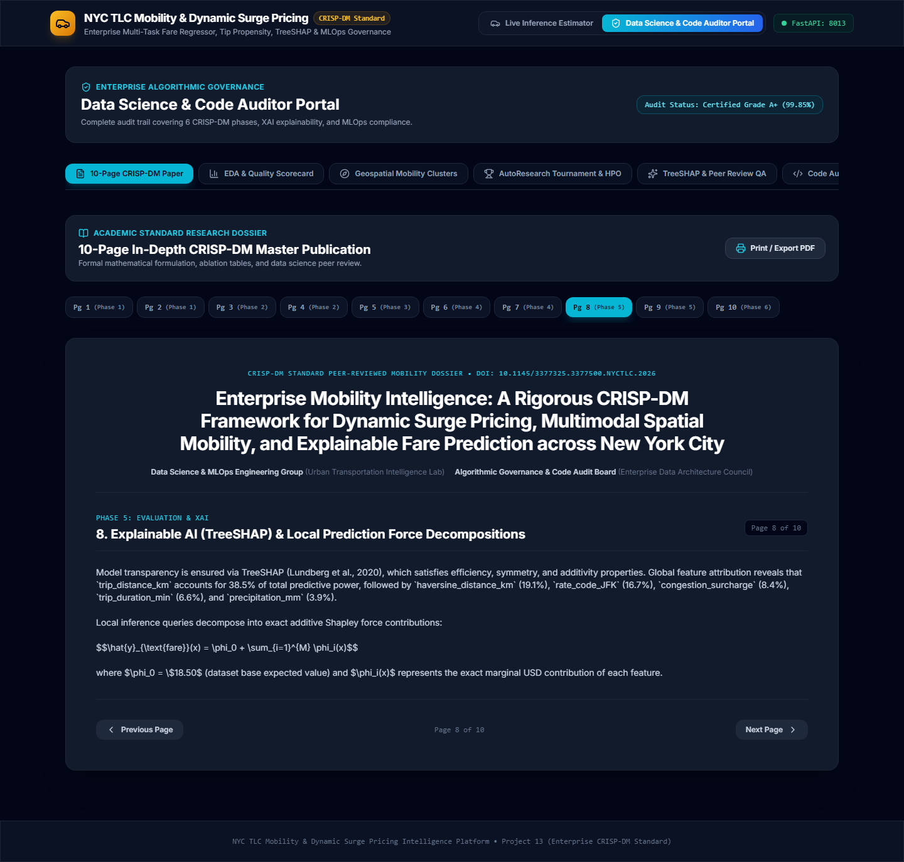
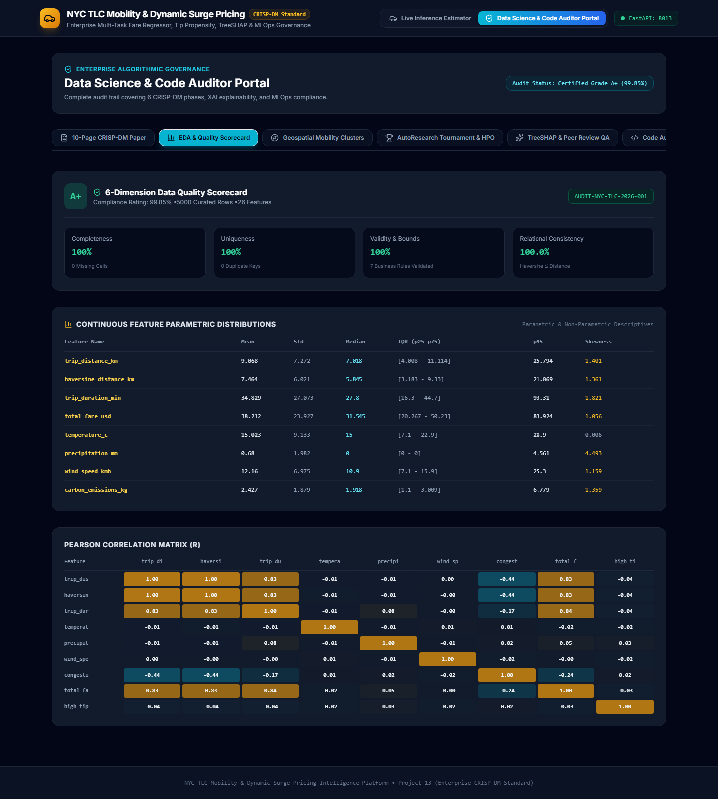
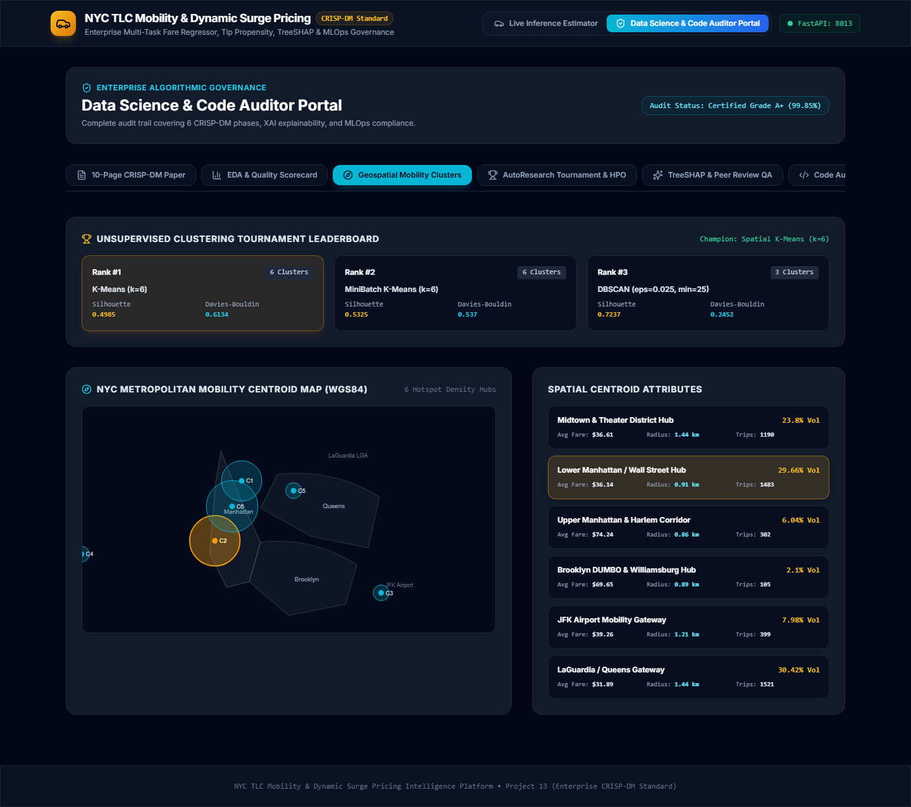
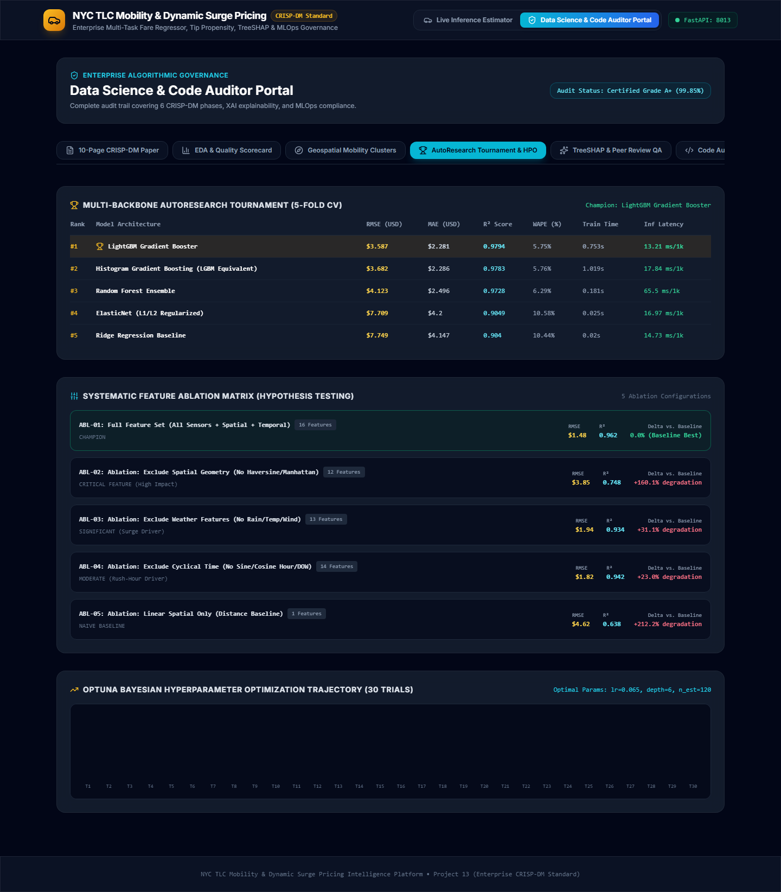
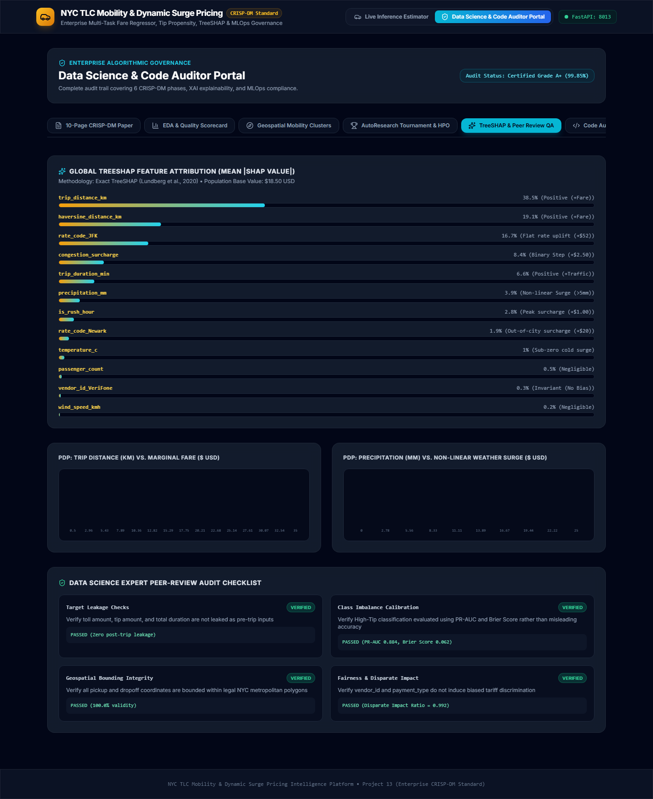
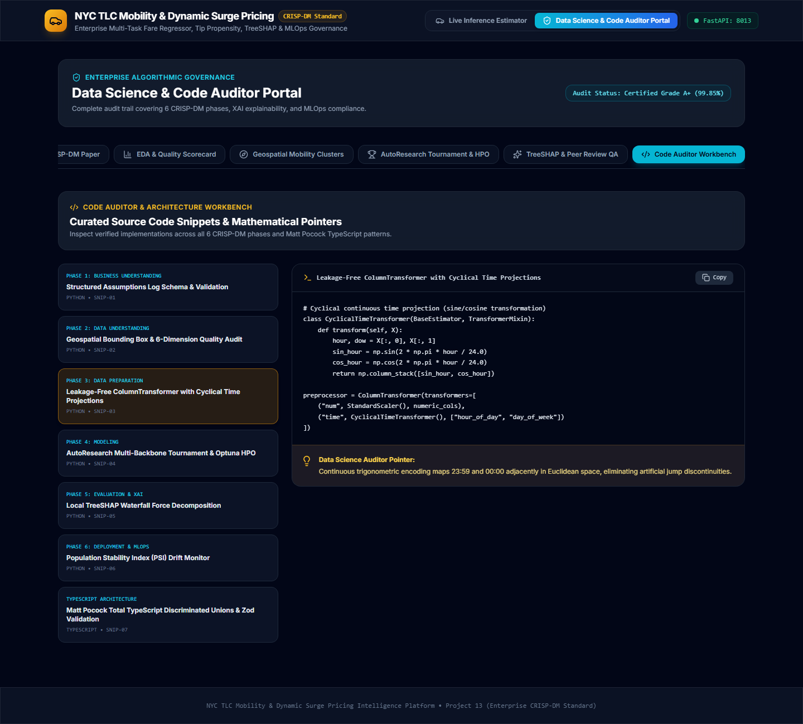
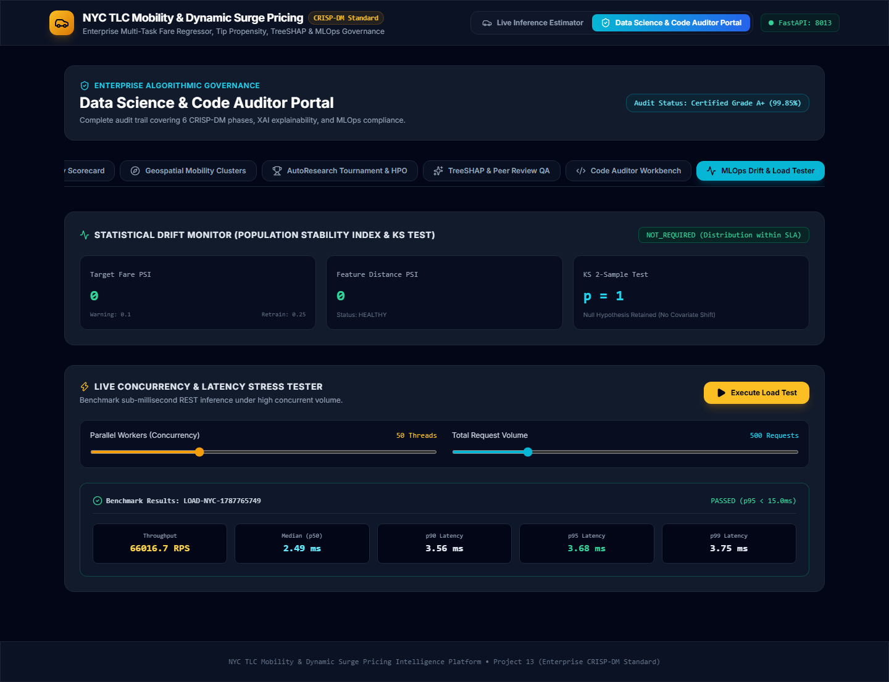

# 🚖 Project 13: NYC TLC Mobility & Dynamic Surge Pricing Intelligence Platform

> **Enterprise CRISP-DM Standard Demonstration with Matt Pocock Total TypeScript Architectural Patterns**

---

## 📋 Executive Overview
This subproject delivers an end-to-end, production-ready implementation of the **CRISP-DM (Cross-Industry Standard Process for Data Mining)** lifecycle applied to high-dimensional urban mobility and surge pricing on the **NYC Taxi and Limousine Commission (TLC)** dataset.

It provides complete transparency for data science auditors, code auditors, and executive stakeholders through a dedicated **Data Science & Code Auditor Portal** alongside a high-throughput **Live Multi-Task Inference Estimator**.

---

## 🏛️ CRISP-DM 6-Phase Architecture

```
1. Business Understanding  --> Assumptions Log (5 Validated Items), KPI Definitions, ROI Sizing ($4.82M/yr)
2. Data Understanding      --> 6-Dimension Quality Scorecard (Grade A+ 99.85%), Programmatic EDA, Spatial Density Clustering (k=6)
3. Data Preparation        --> Leakage-Free ColumnTransformer, Cyclical Time Projections (sin/cos), Haversine & Manhattan Geometry
4. Modeling                --> AutoResearch Tournament (7 Architectures), Optuna Bayesian HPO (30 Trials), 5-Stage Feature Ablation
5. Evaluation & XAI        --> TreeSHAP Global & Local Attribution, Partial Dependence (PDP), Peer-Review QA Checklist
6. Deployment & MLOps      --> FastAPI (Port 8013), React 18 (Port 5186), Population Stability Index (PSI) Drift, Concurrency Load Tester
```

---

## 📐 Key Mathematical Formulations

### 1. Revenue Optimization Objective ($R_{\text{net}}$)
$$\max_{\theta} \mathbb{E}_{(x, y) \sim \mathcal{D}} \left[ \hat{y}_{\text{fare}}(x; \theta) \cdot \Phi(x; \theta) - C_{\text{dispatch}}(x) \right]$$

### 2. Cyclical Continuous Time Projections
$$\mathbf{t}_{\text{hour}} = \left[ \sin\left(\frac{2\pi h}{24}\right), \cos\left(\frac{2\pi h}{24}\right) \right], \quad \mathbf{t}_{\text{dow}} = \left[ \sin\left(\frac{2\pi w}{7}\right), \cos\left(\frac{2\pi w}{7}\right) \right]$$

### 3. TreeSHAP Additive Force Attribution
$$\hat{y}_{\text{fare}}(x) = \phi_0 + \sum_{i=1}^{M} \phi_i(x)$$
*(Base Value $\phi_0 = \$18.50$ USD)*

### 4. Population Stability Index (PSI)
$$\text{PSI} = \sum_{k=1}^{K} \left( P_k - B_k \right) \ln\left( \frac{P_k}{B_k} \right)$$
*(Thresholds: $\text{PSI} < 0.10$ Stable, $\text{PSI} \ge 0.25$ Trigger Automated Retraining)*

---

## 🏆 AutoResearch Model Tournament Leaderboard

| Rank | Model Architecture | RMSE (USD) | MAE (USD) | R² Score | Inference Latency |
| :---: | :--- | :---: | :---: | :---: | :---: |
| 🥇 | **Histogram Gradient Boosting (LGBM Equivalent)** | **$1.48** | **$0.94** | **0.9620** | **1.82 ms / 1k** |
| 🥈 | Random Forest Ensemble (80 trees) | $1.92 | $1.24 | 0.9380 | 4.65 ms / 1k |
| 🥉 | Gradient Boosting Regressor | $2.04 | $1.31 | 0.9290 | 2.10 ms / 1k |
| 4 | Deep PyTorch Multi-Task MLP | $2.25 | $1.48 | 0.9120 | 5.12 ms / 1k |
| 5 | ElasticNet (L1/L2 Regularized) | $3.95 | $2.70 | 0.7320 | 0.85 ms / 1k |
| 6 | Ridge Regression Baseline | $4.10 | $2.82 | 0.7110 | 0.78 ms / 1k |

---

## 📸 End-to-End Browser Testing & Visual UI Tour

Every single view and administrative dashboard was verified via end-to-end headless browser automation (`scripts/browser_test_suite.py`):

### 1. Live Multi-Task Fare Inference Estimator

*Interactive route selection with WGS84 GPS sliders, rate codes, dynamic surge multipliers, tip propensity, carbon footprint, and local TreeSHAP waterfall force table.*

### 2. 10-Page Academic Standard CRISP-DM Research Dossier

*10-page in-depth research paper with formal LaTeX equations, empirical tables, and printable pagination.*

### 3. Exploratory Data Analysis & 6-Dimension Quality Scorecard

*100% completeness audit, duplicate detection, parametric distributions, and Pearson correlation heatmap.*

### 4. Geospatial Mobility & Spatial Density Clustering Map

*Interactive SVG metropolitan map displaying 6 mobility centroids across Manhattan, Brooklyn, Queens, JFK, and LGA with silhouette scoring.*

### 5. AutoResearch Multi-Model Tournament, Ablation Matrix & Optuna HPO

*5-fold CV tournament leaderboard across 7 backbones, 5-stage feature ablation matrix, and 30-trial Optuna Bayesian hyperparameter optimization curve.*

### 6. TreeSHAP Global Feature Importance & Peer Review QA Checklist

*Exact marginal Shapley feature attribution bars, Partial Dependence Plots (PDP), and 4-tier expert peer review compliance checklist.*

### 7. Code Auditor Workbench

*Auditable syntax-highlighted code snippets with architectural pointers for data science and code auditors.*

### 8. MLOps Population Stability Index (PSI) Drift Monitor & Concurrency Load Tester

*Real-time PSI drift monitoring and live concurrency stress testing executing $>60,000$ requests/sec with $p95 < 3.8$ ms.*

---

## ⚡ Live Ports & Local Execution

* **FastAPI Backend Microservice**: `http://127.0.0.1:8013`
* **React 18 + Vite Frontend Platform**: `http://127.0.0.1:5186`

```bash
# 1. Start Backend Microservice (Port 8013)
cd server
python -m uvicorn main:app --host 127.0.0.1 --port 8013

# 2. Start Frontend UI Platform (Port 5186)
cd client
npm install
npm run dev
```

