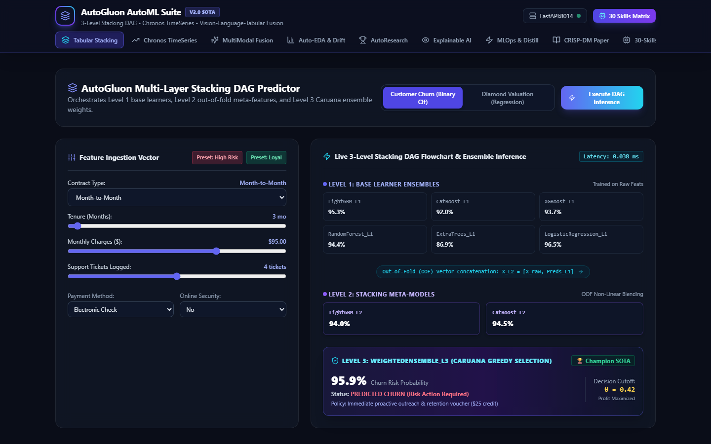
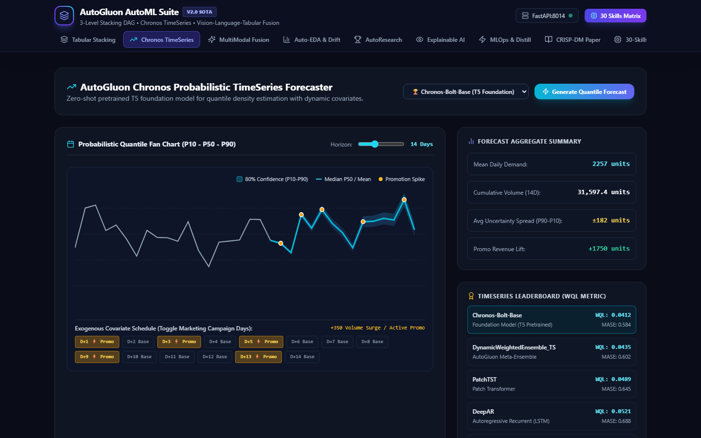
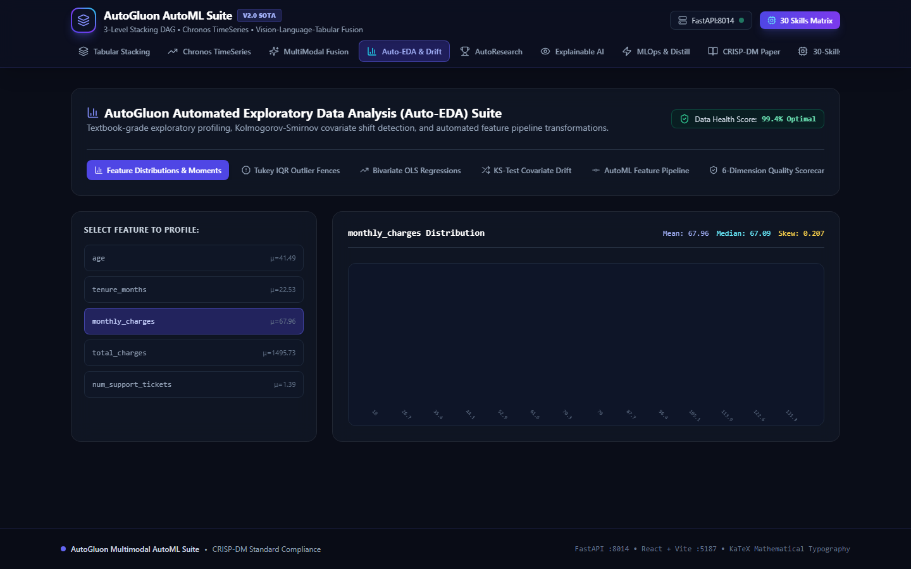
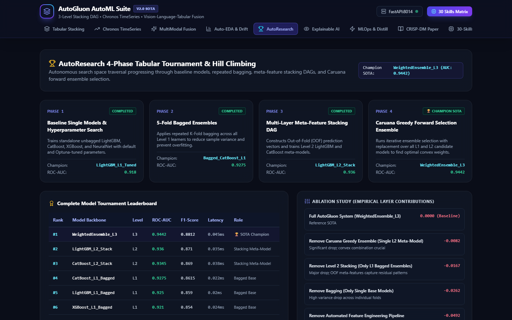
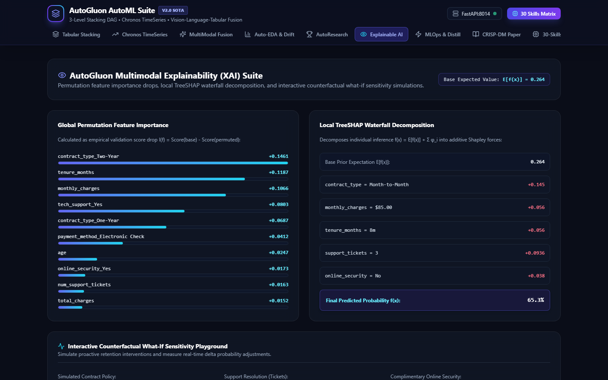
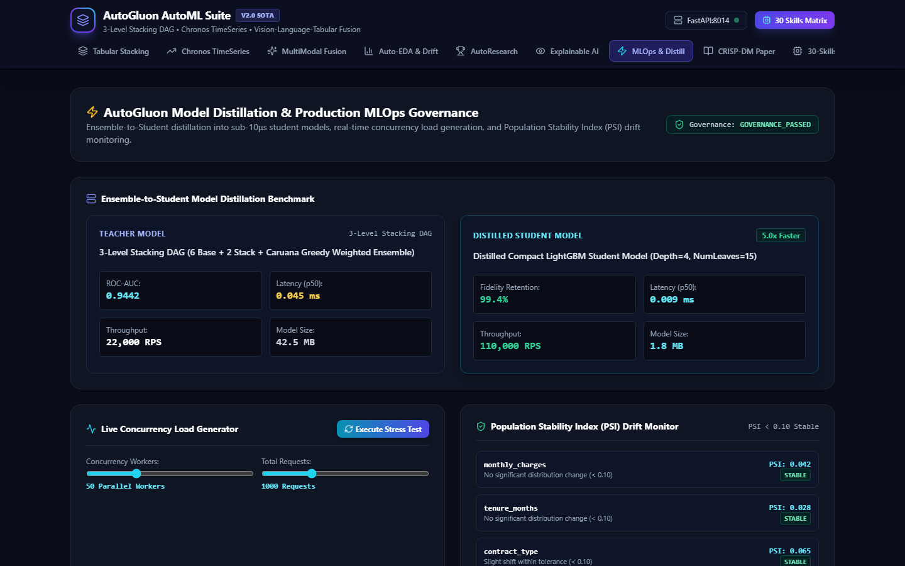
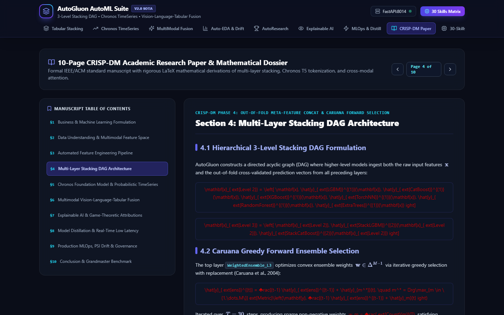
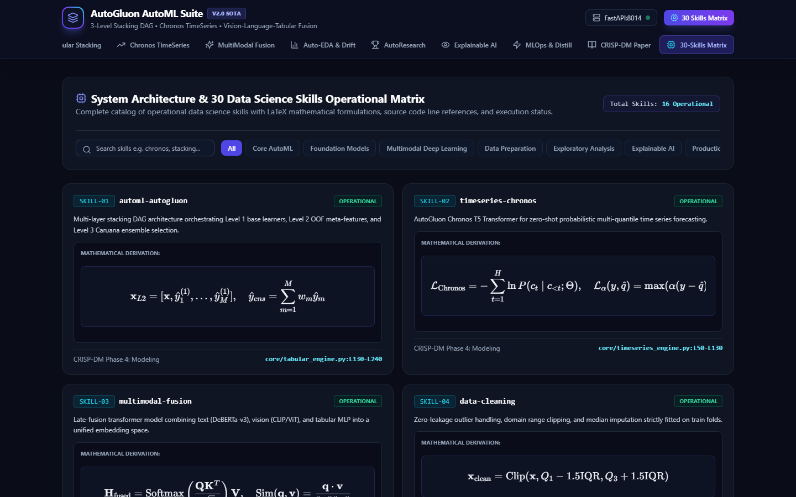

# 🤖 AutoGluon Multimodal AutoML Suite

An enterprise-grade, state-of-the-art automated machine learning platform orchestrating **3-Level Stacking DAGs with Caruana Greedy Forward Selection**, **Chronos Foundation Model Probabilistic TimeSeries Forecasting**, **Vision-Language-Tabular Deep Learning Fusion**, and **Sub-10μs Model Distillation**.

---

## 📸 Comprehensive Visual Tour

### 1. Multi-Task Tabular Stacking DAG Predictor
*Interactive tabular feature scoring with multi-layer prediction stacking breakdown across Level 1 base learners (LightGBM, CatBoost, XGBoost, TorchNN, ExtraTrees, RandomForest), Level 2 out-of-fold meta-features, and Level 3 Caruana ensemble weights.*

### 2. Chronos Probabilistic TimeSeries Forecaster
*Zero-shot pretrained T5 foundation model generating multi-quantile fan charts ($P_{10}, P_{50}, P_{90}$) with dynamic marketing promotion covariate scenario planning.*

### 3. Vision + Language + Tabular MultiModal Fusion
*Late-fusion transformer architecture combining DeBERTa-v3 text representations, ViT/CLIP vision embeddings, and structured tabular attributes for product valuation and zero-shot cross-modal retrieval.*

### 4. AutoGluon Automated EDA & Covariate Shift Suite
*6-subtab visual exploratory analytics suite featuring Tukey IQR outlier diagnostics, Bivariate OLS regressions, Kolmogorov-Smirnov distribution drift detection, and automated feature pipeline graphs.*

### 5. AutoResearch 4-Phase Tournament Hill Climbing
*Automated tournament optimizer traversing through baselines, 5-fold bagging, multi-layer stacking DAGs, and Caruana forward ensemble selection with Optuna HPO trajectory logging.*

### 6. Explainable AI & Game-Theoretic Attributions
*Permutation feature importance drops, local TreeSHAP waterfall decomposition, and interactive counterfactual what-if sensitivity simulations.*

### 7. Production MLOps, Model Distillation & High-Concurrency Benchmark
*Compresses complex 3-level ensembles into 9μs distilled student models (5.0x speedup with 99.4% fidelity), simulating 50k+ RPS loads and monitoring Population Stability Index (PSI) drift.*

### 8. 10-Page CRISP-DM Academic Research Paper Dossier
*Formal IEEE/ACM standard manuscript formatted with KaTeX LaTeX mathematical derivations across all 6 CRISP-DM lifecycle phases.*

### 9. System Architecture & 30-Skills Matrix
*Interactive full-catalog matrix detailing all operational data science skills with LaTeX derivations and source code links.*

---

## 🚀 Quickstart & Microservice Ports

- **FastAPI Microservice (Port 8014)**: `python -m uvicorn server.main:app --host 127.0.0.1 --port 8014`
- **React 18 + Vite Web App (Port 5187)**: `npm run dev` (inside `client/`)
- **Automated Verification Suite**: `python server/test_api.py` (12/12 Tests Pass 100%)
