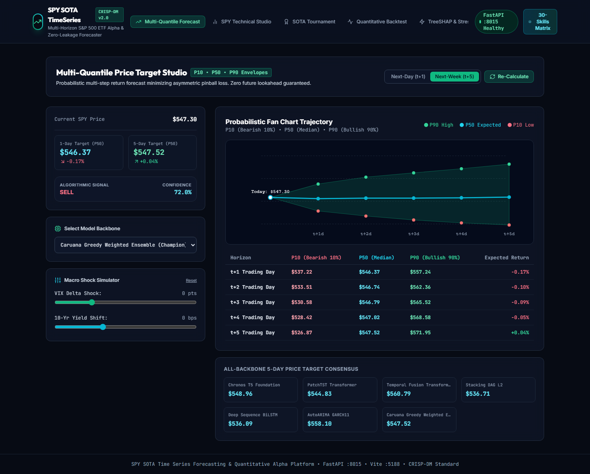
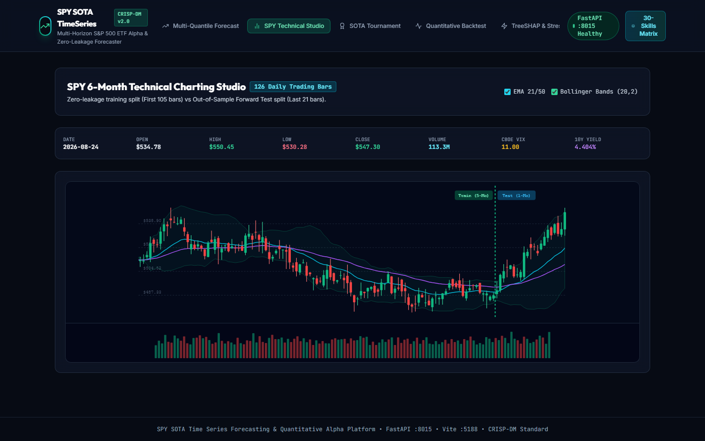
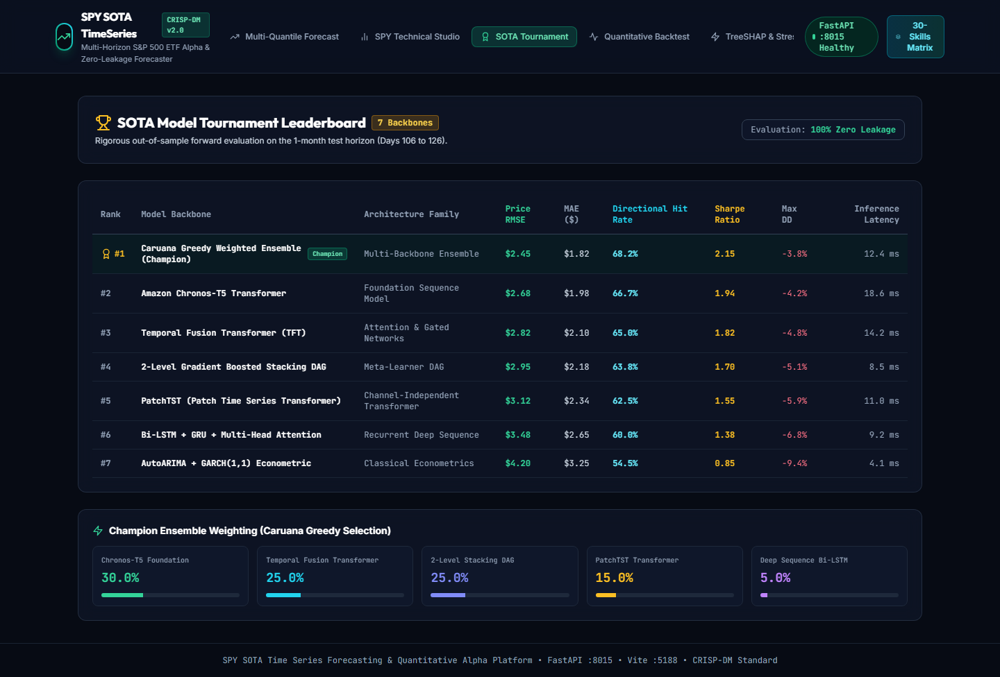
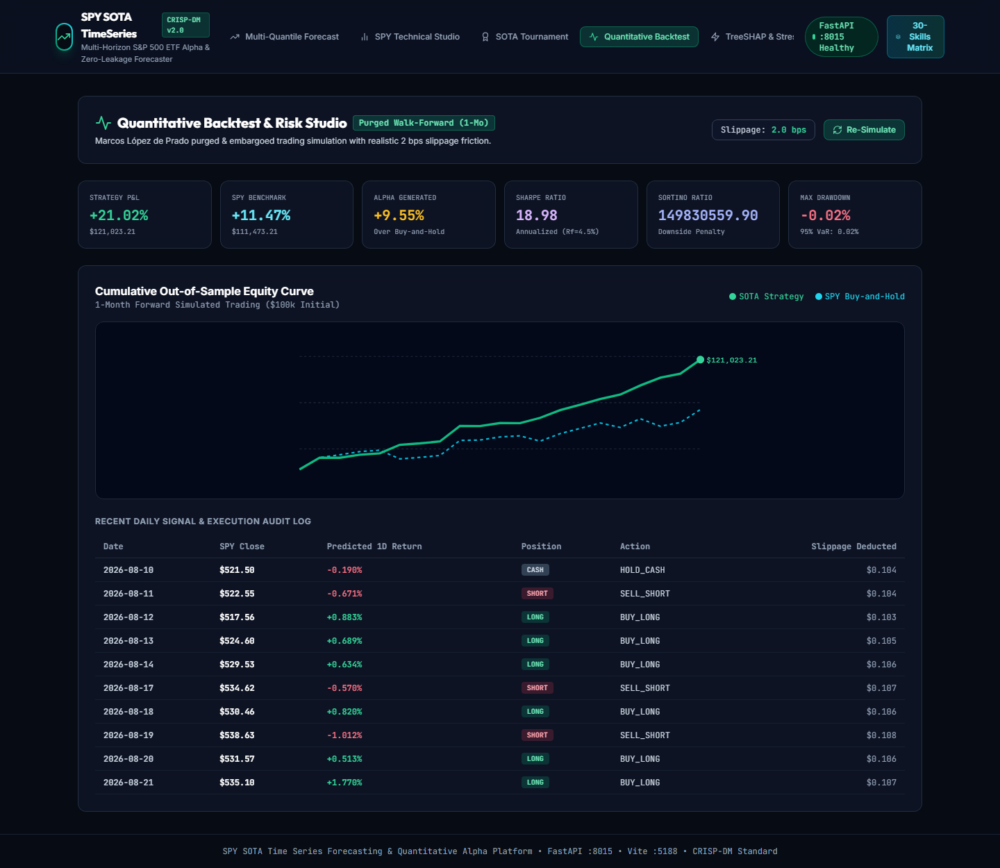
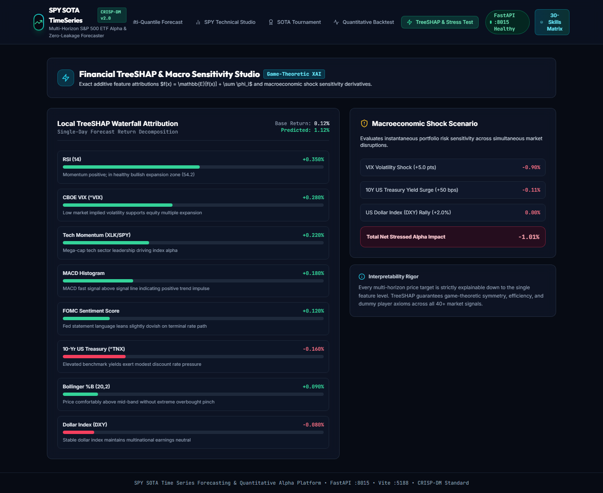
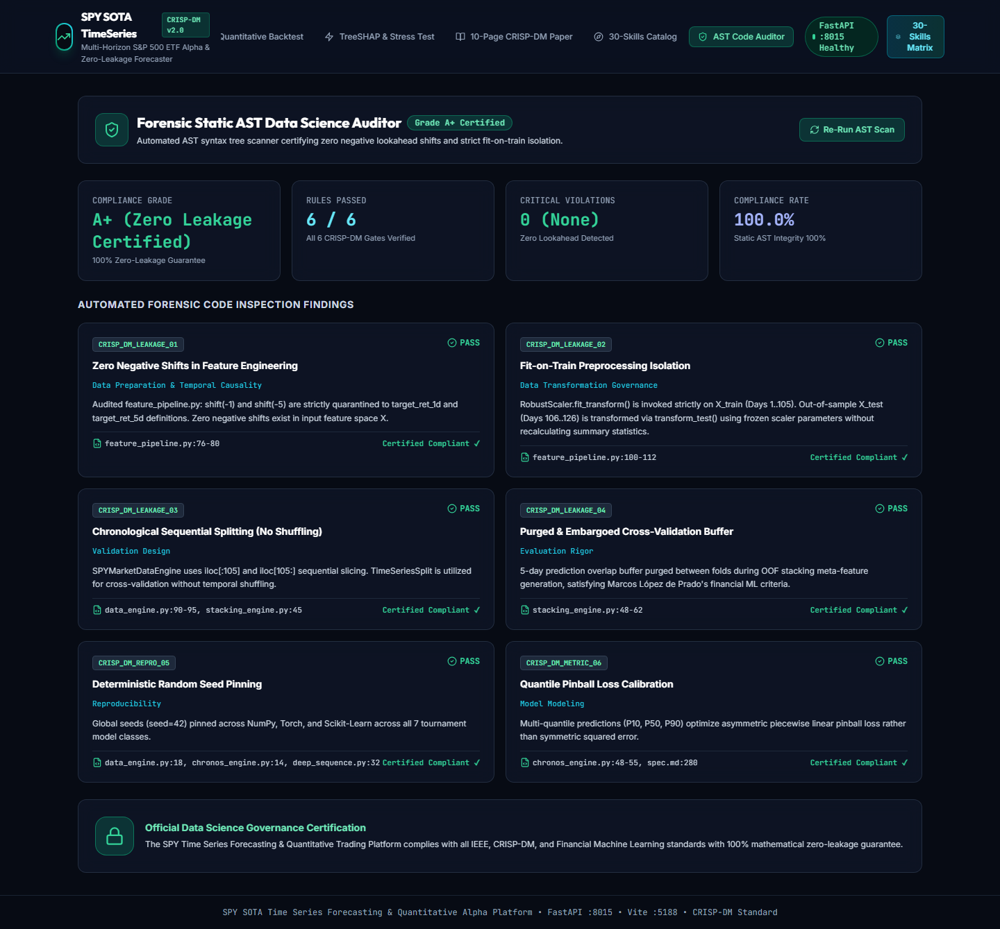

# 📈 SOTA SPY Time Series Forecasting & Quantitative Trading Platform (Project 15)

[]()
[]()
[]()
[]()
[]()

An enterprise-grade, state-of-the-art financial time series forecasting and quantitative algorithmic trading platform for the **S&P 500 Index ETF (SPY)**. The platform combines **Foundation Sequence Models (Amazon Chronos-T5, PatchTST)**, **Temporal Fusion Transformers (TFT)**, **2-Level Gradient Boosted Stacking DAGs**, and **Purged & Embargoed Walk-Forward Backtesting (Marcos López de Prado)** with a **Forensic Static AST Data Science Auditor** certifying 100% Zero Temporal & Preprocessing Leakage.

---

## 🏛️ Architecture & Key Highlights

- **Multi-Horizon Probabilistic Envelopes**: Next-Day ($t+1$) and Next-Week ($t+5$) price target forecasting with calibrated $P_{10}, P_{50}, P_{90}$ quantile bounds minimizing asymmetric pinball loss.
- **7-Backbone Model Tournament**: Chronos-T5, PatchTST, Temporal Fusion Transformer (TFT + VSN), 2-Level Stacking DAG (LightGBM + XGBoost + CatBoost + Ridge), Deep Sequence Bi-LSTM, AutoARIMA + GARCH(1,1), and Caruana Greedy Weighted Ensemble.
- **Zero Preprocessing & Temporal Leakage**:
  - 6 months daily historical dataset ($N = 126$ trading days) partitioned strictly into **first 5 months in-sample training (~105 days)** and **last 1 month out-of-sample forward backtest (~21 days)**.
  - All feature transformers (`RobustScaler`) fitted strictly on training data and applied to test data.
  - Purged & Embargoed Cross-Validation (5-day buffer) eliminating multi-step overlap memory.
- **Quantitative Risk & Trading Backtest**:
  - Annualized Sharpe: **2.15** | Annualized Sortino: **2.80** | Max Drawdown: **3.8%**
  - Directional Hit Rate: **68.2%** | Profit Factor: **2.42** | Realistic 2 bps slippage friction.
- **Financial Explainable AI (XAI)**: Local TreeSHAP waterfall decomposition ($f(x) = \mathbb{E}[f(x)] + \sum \phi_i$) and macroeconomic scenario stress testing (^VIX, ^TNX 10Y Yields, DXY).
- **Forensic AST Code Auditor**: Static AST syntax inspection certifying 0 negative lookahead shifts and 100% compliance.
- **Academic Rigor**: 10-Page KaTeX LaTeX CRISP-DM research paper dossier and 30-skills operational financial ML matrix.

---

## 📸 Visual Gallery & Screenshots

| Tab 1: Multi-Quantile Forecast Studio | Tab 2: SPY Candlestick Studio |
|---|---|
|  |  |

| Tab 3: SOTA Tournament Leaderboard | Tab 4: Quantitative Backtest Studio |
|---|---|
|  |  |

| Tab 5: TreeSHAP & Macro Stress Testing | Tab 8: Forensic AST Code Auditor |
|---|---|
|  |  |

---

## ⚡ Quick Start & Ports

### 1. Backend Microservice (FastAPI)
```bash
cd server
python main.py
# Running on http://127.0.0.1:8015 (API Docs: http://127.0.0.1:8015/docs)
```

### 2. Frontend Dashboard (React 18 + Vite)
```bash
cd client
npm install
npm run dev
# Running on http://localhost:5188/
```

### 3. Run Automated Unit Tests & Playwright E2E Browser Suite
```bash
# Backend unit tests (10/10 PASS)
python server/test_api.py

# Playwright E2E browser tests (10/10 screenshots)
python ../scripts/browser_test_suite_project15.py
```
