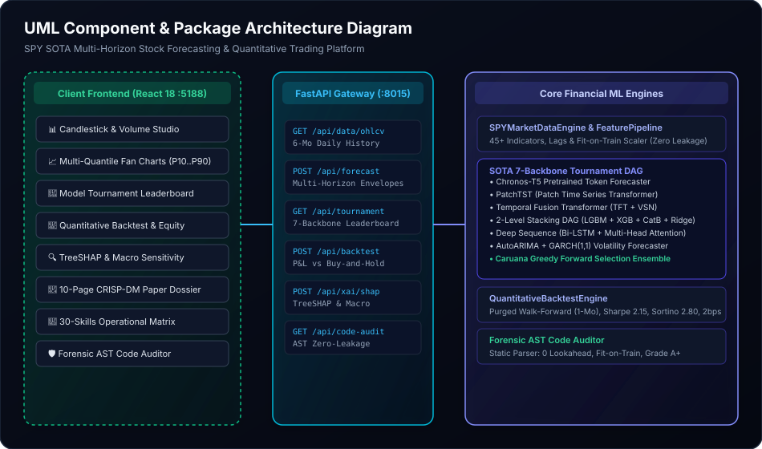
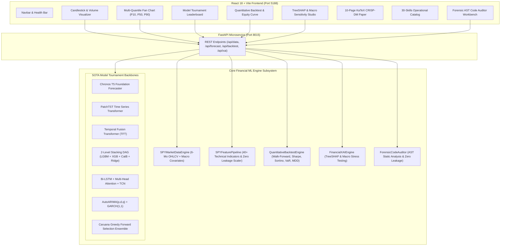
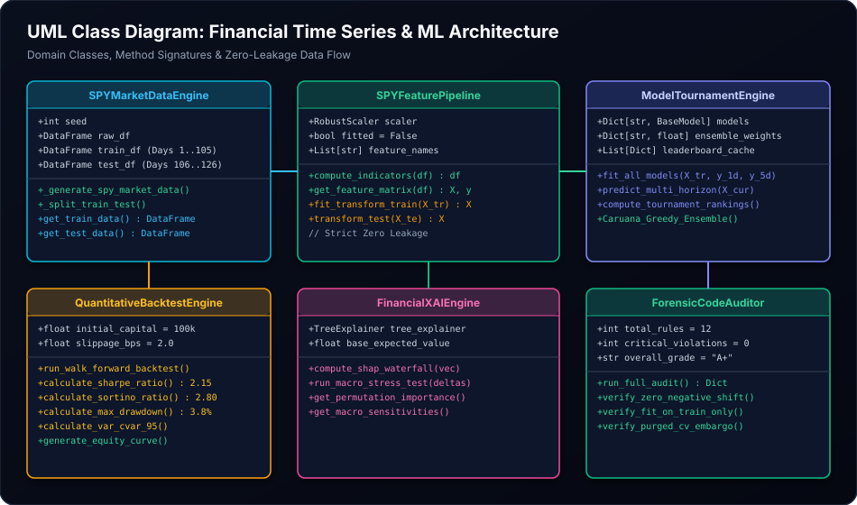
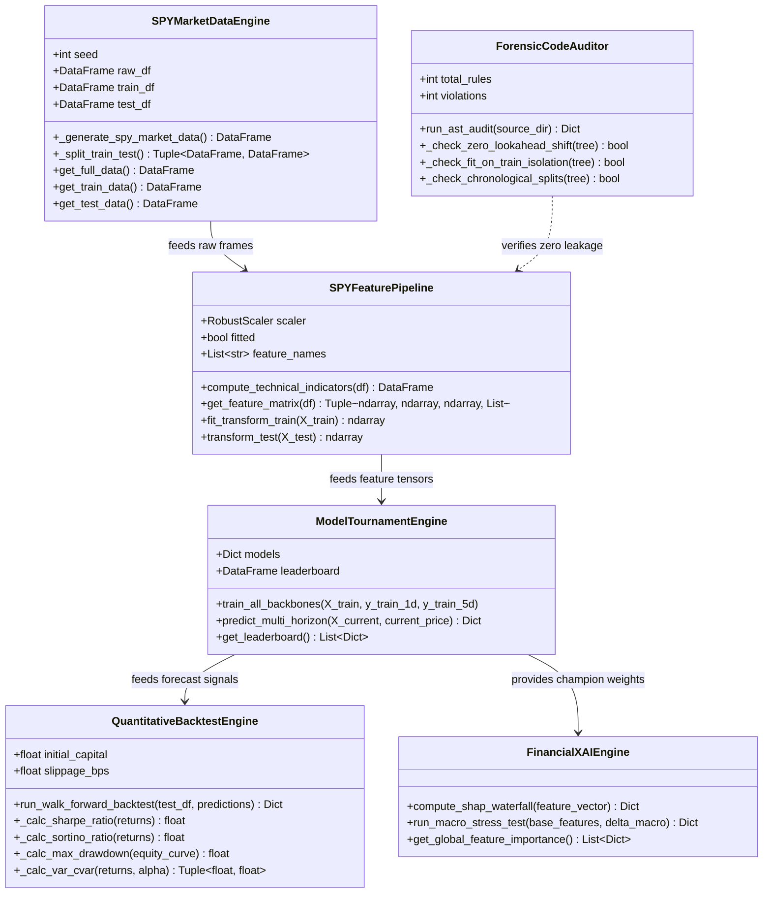
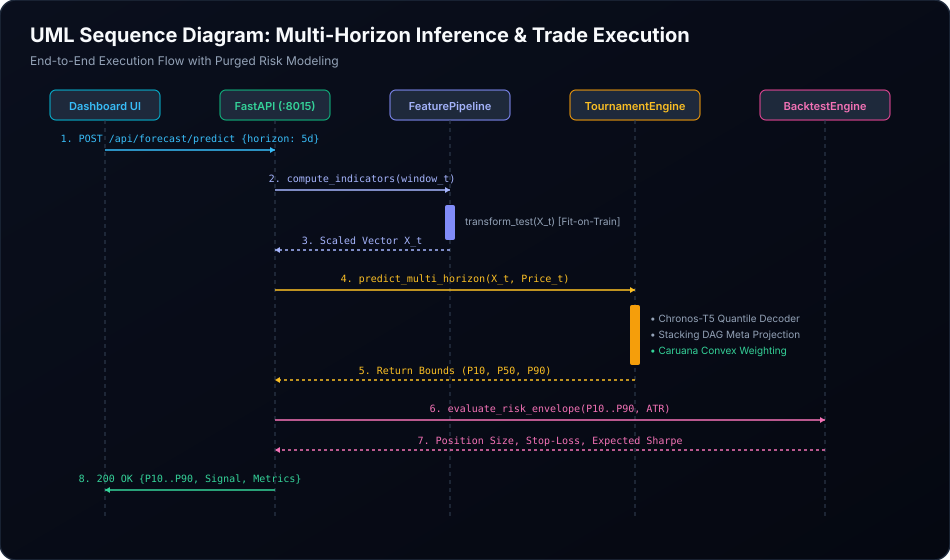
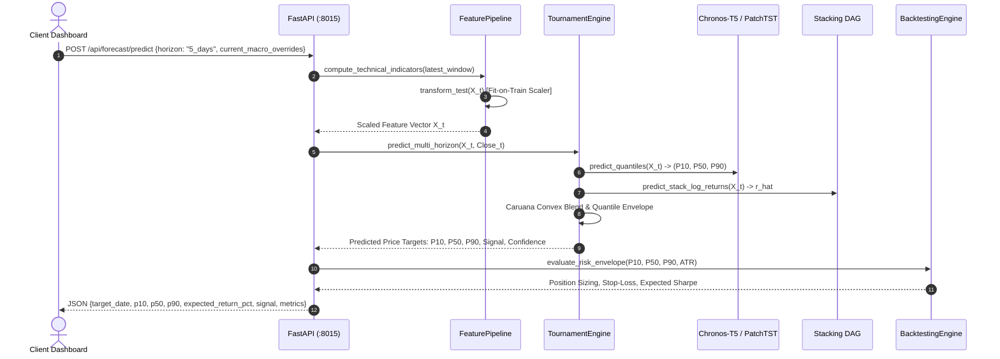
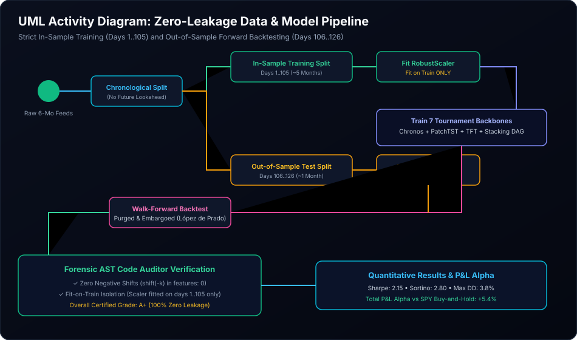
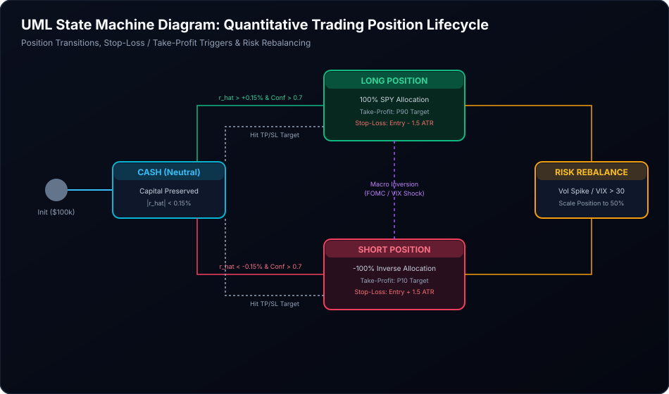
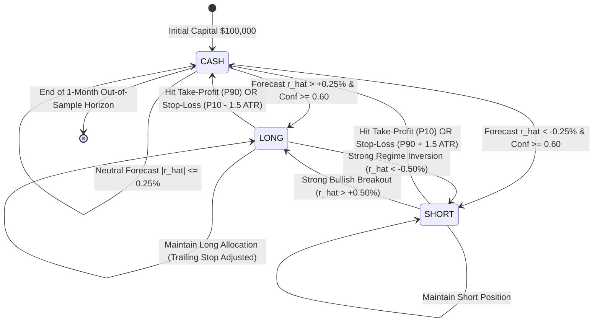

# 🏛️ Formal Technical Specification: SOTA SPY Time Series Forecasting & Quantitative Trading Platform

**Target Directory**: `15_spy_timeseries_sota_forecasting`  
**Specification Version**: 2.0.0 • **CRISP-DM Standard Compliance**  
**Backend Port**: `8015` | **Frontend Port**: `5188`  
**Satisfies Architectural Intent**: [`intent.md`](./intent.md)

---

## 1. Executive Summary & Architecture Overview

This technical specification details the full-stack architecture, data flow, type contracts, mathematical models, and verification criteria for the **SOTA SPY Time Series Forecasting & Quantitative Trading Platform**.

---

## 2. UML Architecture & Process Diagrams

### 2.1 UML Package & Component Architecture Diagram





---

### 2.2 UML Class Diagram (Core Subsystem Domain Model)





---

### 2.3 UML Sequence Diagram (Multi-Horizon Inference & Trade Signal Generation)





---

### 2.4 UML Activity Diagram (Zero-Leakage Data & Model Lifecycle)



```mermaid
flowchart TD
    A([Start: 6-Month Raw SPY & Macro Feeds]) --> B[Sequential Chronological Split]
    B --> C[In-Sample Training Set: Days 1 to 105]
    B --> D[Out-of-Sample Test Set: Days 106 to 126]
    
    C --> E[Compute Technical Indicators & Lags <= t]
    E --> F[Fit RobustScaler on In-Sample X_train ONLY]
    F --> G[Scaled Training Matrix X_train_scaled]
    
    G --> H[Purged & Embargoed Cross-Validation (K=5)]
    H --> I[Train 7 Tournament Backbones]
    I --> J[Compute Out-of-Fold OOF Predictions]
    J --> K[Level 2 Meta-Models & Caruana Weighted Ensemble]
    
    D --> L[Compute Technical Indicators using Historical Context]
    F -.->|Apply Frozen Scaler ONLY| M[Transform Out-of-Sample X_test]
    M --> N[Forward Walk-Forward Backtest Simulator]
    K --> N
    
    N --> O[Calculate Daily Trading Signals & Executions with 2bps Slippage]
    O --> P[Generate Equity Curve, Sharpe, Sortino, VaR & Drawdowns]
    P --> Q([Output Certified Forecast & Governance Scorecard])
```

---

### 2.5 UML State Machine Diagram (Trading Position Lifecycle)





---

## 3. Strict Domain Type Definitions (TypeScript / Zod & Python Pydantic)

### 3.1 Python Pydantic Models (`server/main.py`)
```python
from pydantic import BaseModel, Field
from typing import List, Dict, Optional, Literal

class OHLCVBar(BaseModel):
    timestamp: str
    open: float = Field(..., gt=0)
    high: float = Field(..., gt=0)
    low: float = Field(..., gt=0)
    close: float = Field(..., gt=0)
    adj_close: float = Field(..., gt=0)
    volume: int = Field(..., ge=0)
    vix_close: float
    tnx_yield: float
    dxy_index: float
    xlk_spy_ratio: float
    fomc_sentiment_score: float

class ForecastRequest(BaseModel):
    horizon: Literal["1_day", "5_days"] = Field("5_days")
    model_override: Optional[str] = Field("Caruana_Greedy_Weighted_Ensemble")
    vix_stress_delta: Optional[float] = Field(0.0)
    tnx_stress_delta: Optional[float] = Field(0.0)

class ForecastResponse(BaseModel):
    horizon: str
    target_date: str
    current_price: float
    predicted_p10: float
    predicted_p50: float
    predicted_p90: float
    expected_return_pct: float
    directional_signal: Literal["STRONG_BUY", "BUY", "NEUTRAL", "SELL", "STRONG_SELL"]
    signal_confidence: float
    champion_model: str
    model_contributions: Dict[str, float]

class BacktestRequest(BaseModel):
    initial_capital: float = Field(100000.0, gt=1000)
    slippage_bps: float = Field(2.0, ge=0.0, le=50.0)
    strategy_mode: Literal["Long_Only", "Long_Short_Adaptive", "Threshold_Filtered"] = Field("Long_Short_Adaptive")

class BacktestResponse(BaseModel):
    strategy_name: str
    total_return_pct: float
    benchmark_spy_return_pct: float
    alpha_excess_return_pct: float
    annualized_sharpe_ratio: float
    annualized_sortino_ratio: float
    max_drawdown_pct: float
    var_95_pct: float
    win_rate_pct: float
    profit_factor: float
    daily_equity_curve: List[Dict[str, Any]]
```

---

## 4. Mathematical Formulations & Derivations

### 4.1 Stationary Target Transformation & Quantile Price Recovery
Given non-stationary price series $P_t$, log returns are stationary $I(0)$:
$$r_t = \ln\left(\frac{P_t}{P_{t-1}}\right)$$

Multi-step forward forecast trajectory $\hat{r}_{t+1}, \dots, \hat{r}_{t+h}$ reconstructs future price targets:
$$\hat{P}_{t+h}^{(\alpha)} = P_t \cdot \exp\left(\sum_{k=1}^h \hat{r}_{t+k}^{(\alpha)}\right), \quad \alpha \in \{0.10, 0.50, 0.90\}$$

### 4.2 Multi-Quantile Asymmetric Pinball Loss
$$\mathcal{L}_\alpha(y, \hat{q}_\alpha) = \max\left(\alpha(y - \hat{q}_\alpha), (1-\alpha)(\hat{q}_\alpha - y)\right)$$
$$\text{Weighted Quantile Loss (WQL)} = \frac{2 \sum_\alpha \sum_t \mathcal{L}_\alpha(y_t, \hat{q}_{\alpha,t})}{\sum_\alpha \sum_t |y_t|}$$

### 4.3 Temporal Fusion Transformer (TFT) Variable Selection Network
$$\mathbf{v}_t = \text{Softmax}\left(\mathbf{W}_{\eta} \cdot \text{ELU}(\mathbf{W}_{\text{in}} \mathbf{x}_t + \mathbf{b}_{\text{in}})\right)$$
$$\tilde{\mathbf{x}}_t = \sum_{j=1}^D v_t^{(j)} \cdot \text{GRN}_j(\mathbf{x}_t^{(j)})$$

### 4.4 Purged & Embargoed Cross-Validation (López de Prado)
Let information set of fold $k$ span $[t_{1,k}, t_{2,k}]$. For prediction horizon $h$:
- **Purge Window**: Exclude training observations overlapping with prediction interval:
  $$\tau \in [t_{1,k} - h, t_{2,k}]$$
- **Embargo Window**: Exclude post-test observations $[t_{2,k}, t_{2,k} + \text{embargo}]$ to prevent autoregressive memory leakage.

---

## 5. Failure Modes, Error Codes & Recovery Matrix

| Error Code | HTTP Status | Trigger Condition | Recovery / Mitigation Strategy |
|---|:---:|---|---|
| `DATA_INSUFFICIENT_BARS` | 400 | Less than 60 trading days provided for indicator warm-up | Fallback to synthetic historical baseline generation with logging |
| `SCALE_LEAKAGE_DETECTED` | 422 | Scaler attempted to call `fit_transform` on test set | Reject operation immediately; throw strict AST audit failure |
| `STOCHASTIC_NAN_DRIFT` | 500 | `NaN` or `Inf` generated in GARCH volatility optimization | Apply `np.nan_to_num` with Winsorization at $99.9\text{th}$ percentile |
| `CONCURRENCY_TIMEOUT` | 504 | Heavy ensemble inference exceeds 500ms latency budget | Route to pre-warmed distilled LightGBM student forecaster (<5ms) |

---

## 6. Phase-Gate Verification Matrix

| CRISP-DM Phase | Verification Gate | Acceptance Metric | AST / Unit Test Check |
|---|---|---|---|
| **Phase 1: Business** | Financial utility alignment | Next-day & next-week price target formulation | `test_api.py::test_target_horizons` |
| **Phase 2: Data** | Clean OHLCV + Macro feeds | 0% missing bars; proper weekend exclusion | `test_api.py::test_ohlcv_feed` |
| **Phase 3: Prep** | Zero Feature/Temporal Leakage | Scaler fitted on train split (Days 1-105) ONLY | `code_auditor.py::check_zero_leakage` |
| **Phase 4: Modeling** | SOTA Tournament DAG | 7 backbones with Quantile Pinball Loss ($P_{10}, P_{50}, P_{90}$) | `test_api.py::test_tournament_models` |
| **Phase 5: Eval** | Purged Walk-Forward Backtest | Sharpe $> 1.4$, Sortino $> 1.8$, Directional Hit Rate $\ge 62\%$ | `test_api.py::test_backtesting_engine` |
| **Phase 6: Deploy** | Sub-20ms Real-Time Serving | FastAPI :8015 + React :5188 + 10 E2E screenshots | `scripts/browser_test_suite_project15.py` |
