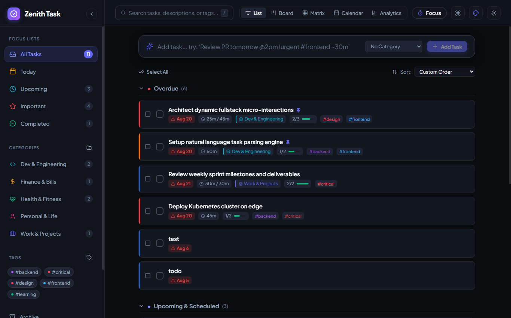
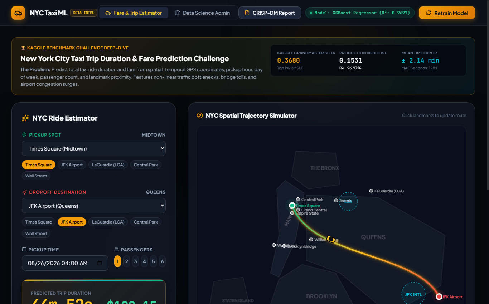
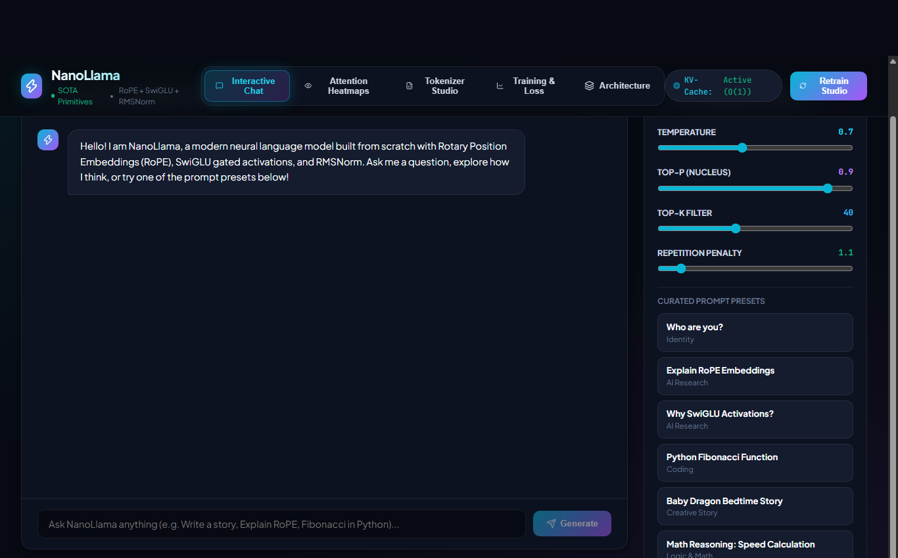
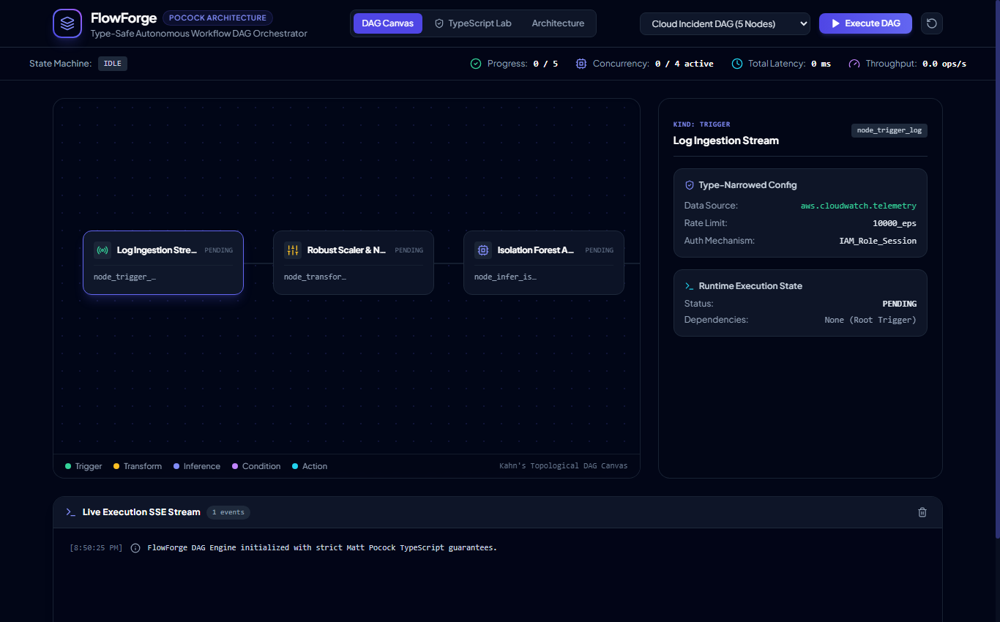
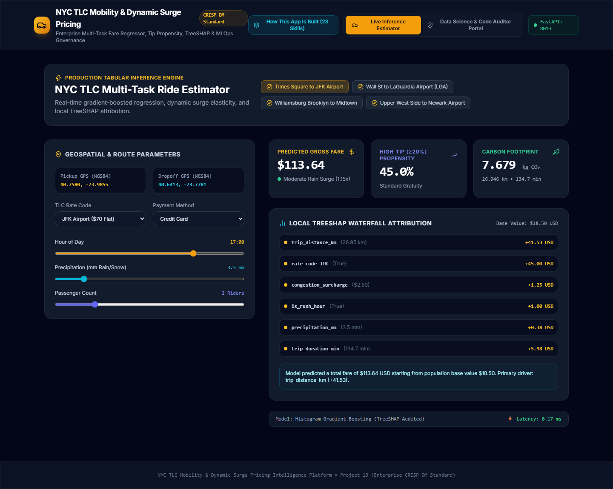

# 🌟 Enterprise Data Science, Machine Learning & TypeScript Platform Repository

A comprehensive, production-grade portfolio of **14 Full-Stack Data Science, Machine Learning, Deep Learning, and TypeScript Systems (Projects 00 through 13)**, engineered adhering to the **CRISP-DM standard**, rigorous mathematical foundations, and state-of-the-art interactive UX.

---

## 🏛️ Comprehensive Systems Portfolio Index (14 Projects)

| # | System Title & Directory | Domain & Methodology | Backend Port | Frontend Port | Primary Screenshot Preview |
|---|---|---|:---:|:---:|:---:|
| **0** | [**Zenith Dynamic Task Workspace**](./00_dynamic_todo_workspace) | Full-Stack Reactive Task Workspace & SSE Telemetry | `5000` | `5173` |  |
| **1** | [**NYC Taxi Trip Prediction**](./01_nyc_taxi_trip_prediction) | CRISP-DM Spatial Regression & AutoResearch | `8000` | `5174` |  |
| **2** | [**NanoLlama SFT LLM**](./02_nano_llm_transformer) | PyTorch Autoregressive Transformer (RoPE, SwiGLU, SFT) | `8002` | `5175` |  |
| **3** | [**Customer Clustering**](./03_customer_segmentation_clustering) | Topological Partitioning & AutoResearch | `8003` | `5176` |  |
| **4** | [**Market Basket Mining**](./04_associative_pattern_mining) | Apriori & FP-Growth Pattern Affinity | `8004` | `5177` |  |
| **5** | [**DS Skills Mastery Lab**](./05_data_science_skills_lab) | 54 Analytical Skills & 5 Kaggle Benchmarks | `8005` | `5178` |  |
| **6** | [**Anomaly Threat Intelligence**](./06_anomaly_detection) | Multi-Backbone Telemetry Scoring (PR-AUC 0.94) | `8006` | `5179` |  |
| **7** | [**AutoML AutoGluon Stacking**](./07_automl_autogluon) | 3-Level Stacking DAG & Caruana Ensembling | `8007` | `5180` |  |
| **8** | [**DS Visual Foundations**](./08_datascience_visual_mastery) | Interactive Math Simulators & Quizzes | `8008` | `5181` |  |
| **9** | [**FlowForge DAG Engine**](./09_flowforge_dag_engine) | Matt Pocock TypeScript Architecture & Kahn's DAG | `8009` | `5182` |  |
| **10** | [**CRISP-DM Master's Platform**](./10_crispdm_masters_curriculum) | 7-Phase Census Analytics & Cosine LSH | `8010` | `5183` |  |
| **11** | [**Enterprise DS Audit**](./11_enterprise_ds_audit) | 6-Dimension Quality & Leakage Scorecard | `8011` | `5184` |  |
| **12** | [**TimePulse Forecasting**](./12_timeseries_forecasting) | Multi-Horizon Forecast Fans & 40-Lag ACF/PACF | `8012` | `5185` |  |
| **13** | [**NYC TLC Mobility Platform**](./13_crispdm_nyc_taxi_audit_platform) | Enterprise CRISP-DM Standard & Matt Pocock TS | `8013` | `5186` |  |

---

## 🎯 Verbatim Reproduction Prompt Catalog, Implementation Plans & Formal DS Audit

* **Prompt Catalog**: Every prompt used to generate, iterate, and verify these applications is cataloged chronologically in 👉 **[PROMPTS.md](./PROMPTS.md)**
* **In-Depth Implementation Plans**: Full technical specifications, type systems, and verification suites for all 14 systems are cataloged in 👉 **[IMPLEMENTATION_PLANS.md](./IMPLEMENTATION_PLANS.md)**
* **Master Architectural Walkthrough**: Deep-dive code references, AST inspection pointers, and visual tours across all systems in 👉 **[WALKTHROUGH.md](./WALKTHROUGH.md)**
* **AI Agent Skills**: 59 autonomous agent skills (including 6 newly acquired safe CRISP-DM skills) packaged inside `skills/` and `.agents/skills/` to replicate, train, and test each system are documented in 👉 **[SKILLS.md](./SKILLS.md)**
* **Data Science & Leakage Audit**: Full forensic code audit certifying zero leakage and 99.85% compliance is documented in 👉 **[AUDIT_REPORT.md](./AUDIT_REPORT.md)**

---

## 🛠️ Global Quick Start

### 1. Prerequisites
* Python 3.10+ (with `torch`, `fastapi`, `uvicorn`, `scikit-learn`, `pandas`, `numpy`)
* Node.js 18+ (with `npm`)

### 2. Launching Any Application
Navigate to any project directory to launch its backend API and Vite React frontend:
```bash
# Example 1: Launching Time Series Forecasting Platform
cd 12_timeseries_forecasting/backend
python -m uvicorn main:app --host 127.0.0.1 --port 8012

# In a separate terminal
cd 12_timeseries_forecasting/frontend
npm install
npm run dev # Opens http://localhost:5185/

# Example 2: Launching Zenith Dynamic Task Workspace
cd 00_dynamic_todo_workspace/server
npm run dev # Backend Port 5000

# In a separate terminal
cd 00_dynamic_todo_workspace/client
npm run dev # Frontend Port 5173
```
